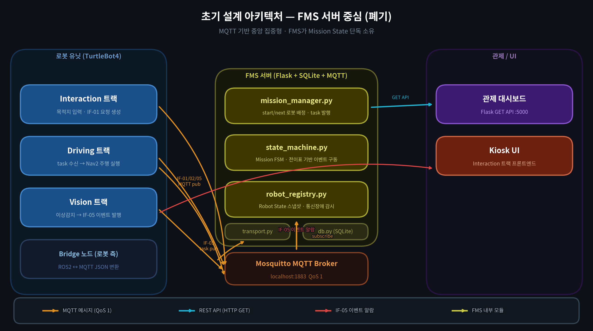
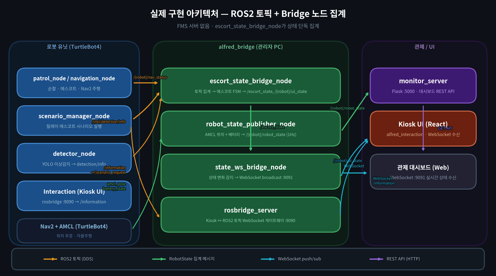

# 🤖 ALFRED — 지하철 자율주행 에스코트 로봇

> **ROKEY 7기 지능1 팀 Alfred**
>
> 지하철역 내 승객의 목적지를 안내하는 다중 로봇 에스코트 시스템.
> 시각장애인을 위한 음성 입력, 사람의 걸음 속도에 맞춘 속도 조절,
> 화재·부상자·위험물 감지 시 관리자 자동 알림을 지원합니다.

---

## 🎬 티저 영상

<div align="center">

[](https://youtu.be/dK5luGPoyV0)

[▶ YouTube에서 보기](https://youtu.be/dK5luGPoyV0)

</div>

---

## 📋 목차

1. [시스템 개요](#1-시스템-개요)
2. [패키지 구조](#2-패키지-구조)
3. [실행 방법](#3-실행-방법)
4. [상태 전이 로직](#4-상태-전이-로직)
5. [요구사항 및 설치](#5-요구사항-및-설치)
6. [내 주요 업무](#6-내-주요-업무)
7. [Trouble Shooting](#7-trouble-shooting)

---

## 1. 🗺️ 시스템 개요

```
┌──────────────────────────────────────────┬───────────────────────────┐
│              관리자 PC 🖥️                 │  키오스크 노트북 💻 (층별)  │
│  (ROS2 허브 + 모니터링 대시보드)            │     (터치/음성 UI)         │
│                                          │                           │
│  alfred_bridge      rosbridge_server     │   alfred_interaction      │
│  alfred_driving     alfred_monitor_server│   (Node.js / React)       │
│  alfred_vision                           │                           │
└──────────────────────────────────────────┴───────────────────────────┘
        │  ROS2 DDS (토픽/액션)                  │
        │◄──────────────────────────────────────│ WebSocket (rosbridge :9090)
        │──────────────────────────────────────►│ WebSocket (state_ws   :9091)
```

| 로봇 | 역할 | 층 |
|------|------|----|
| **robot2** 🟦 | 1층 순찰 + 에스코트 | 1F |
| **robot4** 🟩 | 2층 목적지 안내 | 2F |

**🚦 에스코트 시나리오**

| 요청 | 동작 |
|------|------|
| 1층 → 1층 | robot2 단독 에스코트 후 귀환 |
| 2층 → 2층 | robot4 단독 에스코트 후 귀환 |
| 1층 → 2층 🔀 | robot2가 엘리베이터까지 안내 → robot4가 이어받아 목적지까지 (릴레이) |

---

## 2. 📦 패키지 구조

```
alfred_ws/
└── src/
    ├── alfred_interfaces/           📨 ROS2 커스텀 메시지 정의 (IF-01~05)
    │   └── msg/
    │       ├── Request.msg          IF-01 고객 요청 (ESCORT / CANCEL)
    │       ├── RobotState.msg       IF-02 로봇 상태 보고
    │       ├── Task.msg             IF-03 임무 할당
    │       ├── TaskAck.msg          IF-04 수락/거절 응답
    │       ├── Event.msg            IF-05 이상상황 알림
    │       └── MissionSignal.msg    로봇 간 예외 전파 (ABORT / EMERGENCY)
    │
    ├── alfred_bridge/               🌉 상태 관찰 + WebSocket 브릿지
    │   └── alfred_bridge/
    │       ├── escort_state_bridge_node.py   에스코트 전체 상태 관찰 →
    │       │                                 /escort_state, /{robot}/ui_state
    │       ├── robot_state_publisher_node.py AMCL 위치 + 배터리 →
    │       │                                 /{robot}/robot_state (1Hz)
    │       └── state_ws_bridge_node.py       상태 변화 → WebSocket broadcast
    │                                         (포트 9091)
    │
    ├── alfred_driving/              🚗 로봇 주행 제어
    │   ├── alfred_driving/
    │   │   ├── patrol_node.py              robot2 순찰 루프 + 에스코트 인터럽트
    │   │   ├── navigation_node.py          robot4 단독 목적지 주행
    │   │   ├── web_request_node.py         /information JSON → 릴레이 에스코트
    │   │   ├── rosbridge_node.py           WebSocket /information 수신 (:9090)
    │   │   ├── aruco_tracker_node.py       ArUco 마커 추적 (사용자 ID + 거리)
    │   │   ├── marker_speed_governor.py    마커 크기 → Nav2 SpeedLimit
    │   │   │                               (사람 걸음 속도 추종)
    │   │   ├── scenario_manager_node.py    /scenario_request → 릴레이 에스코트
    │   │   ├── server_request_node.py      /information → /scenario_request 변환
    │   │   ├── escort_node.py              단일 에스코트 Action 실행
    │   │   ├── behavior_node.py            행동 상태 머신 (인터페이스 계층)
    │   │   ├── locations.py                POI 좌표, 순찰 경로, 환승 지점 정의
    │   │   └── nav_to_pose.py              Nav2 NavigateToPose Action 헬퍼
    │   └── launch/
    │       └── web_scenario.launch.py      주행 전체 런치 파일
    │
    ├── alfred_vision/               👁️ 비전 감지 + 영상 스트리밍
    │   └── alfred_vision/
    │       ├── detector_node.py            YOLO 이상감지 → /{ns}/detection/info
    │       ├── event_handler_node.py       감지 이벤트 → 핸들러 호출
    │       ├── video_sender_node.py        WebRTC VP8 영상 스트리밍 (:8081)
    │       ├── vision_resource.py          모델 경로, 클래스 매핑, Confidence 임계값
    │       └── handlers/
    │           ├── fire_handler.py         🔥 화재: 비상구로 이동
    │           ├── injured_handler.py      🚑 부상자: 접근 후 조치완료 대기
    │           ├── suspicious_handler.py   🔪 위험물: 관리자 알림 로깅
    │           └── lost_item_handler.py    👜 분실물: 감지 로깅
    │
    ├── alfred_monitor_server/       📊 관리자 모니터링 웹 서버
    │   └── alfred_monitor_server/
    │       ├── main.py             Flask + ROS2 ingest 엔트리포인트
    │       ├── api.py              REST API (로봇 상태, 이벤트, POI)
    │       ├── ros_ingest.py       ROS2 구독 → 레지스트리 갱신
    │       ├── robot_registry.py   로봇 실시간 상태 레지스트리
    │       ├── db.py               SQLite 이벤트 이력 저장
    │       ├── event_service.py    이벤트 비즈니스 로직
    │       └── store.py            Supabase 연동 (선택)
    │
    ├── alfred_interaction/          🖥️ 키오스크 UI (Node.js / React)
    │   ├── src/                    React + TypeScript 컴포넌트
    │   ├── server/                 Express 프록시 서버 (:8787)
    │   └── RUN.md                  상세 실행 가이드
    │
    ├── astra_camera/               📷 OAK-D 카메라 ROS2 드라이버
    └── astra_camera_msgs/          OAK-D 커스텀 메시지
```

**🚨 감지 클래스 → 이벤트 → 대응 행동**

| 감지 클래스 | 이벤트 타입 | 로봇 행동 |
|-------------|-------------|-----------|
| `fire` | `FIRE` 🔥 | `emergency_exit` 파라미터로 지정된 비상구로 이동 |
| `patient` | `INJURED_PERSON` 🚑 | 부상자 위치 접근 → 관리자 조치완료 신호 대기 |
| `pistol2`, `knife` | `SUSPICIOUS_PERSON` 🔪 | 관리자 대시보드 알림 + 로깅 |
| `wallet`, `bag`, `phone` | `LOST_ITEM` 👜 | 분실물 감지 로깅 |

---

## 3. ▶️ 실행 방법

### 🔨 빌드 (최초 1회 또는 코드 변경 시)

```bash
cd ~/alfred_ws
colcon build
source install/setup.bash
```

---

### 🖥️ 관리자 PC

#### 📡 모니터링 서버 + rosbridge

```bash
# ① rosbridge — 키오스크 UI ↔ ROS 토픽 WebSocket 게이트웨이 (포트 9090)
ros2 launch rosbridge_server rosbridge_websocket_launch.xml

# ② 모니터링 서버 — 로봇 상태·이벤트 대시보드 REST API (포트 5000)
ros2 run alfred_monitor_server server
# 브라우저: http://localhost:5000
```

#### 🌉 브릿지 노드

```bash
# 에스코트 전체 상태 관찰 → /escort_state, /{robot}/ui_state 발행
ros2 run alfred_bridge escort_state_bridge_node

# AMCL 위치 + 배터리 → /{robot}/robot_state 1Hz 발행
ros2 run alfred_bridge robot_state_publisher_node

# 상태 변화 → 연결된 웹 클라이언트에 WebSocket broadcast (포트 9091)
ros2 run alfred_bridge state_ws_bridge_node
```

#### 🚗 주행 (Launch)

```bash
ros2 launch alfred_driving web_scenario.launch.py use_aruco:=true start_bridge:=false
```

런치 파일이 시작하는 노드:

| 노드 | 역할 |
|------|------|
| `patrol_node` | robot2 순찰 웨이포인트 루프 + 에스코트 인터럽트 처리 |
| `rosbridge_node` | WebSocket 포트 9090 — 키오스크 JSON 요청 수신 |
| `server_request_node` | `/information` → `/scenario_request` 포맷 변환 |
| `scenario_manager_node` | `/scenario_request` → 릴레이 에스코트 실행 |
| `aruco_tracker_node` | 웹캠 ArUco 마커 추적 — 사용자 ID + 거리 추정 |
| `marker_speed_governor` ×2 | 마커 크기 → Nav2 SpeedLimit — 사람 걸음 속도 추종 |

> `navigation_node`(robot4)는 런치 파일에서 주석 처리되어 있습니다.
> robot4를 단독 주행으로 사용할 때만 별도 실행:
> ```bash
> ros2 run alfred_driving navigation_node --ros-args -p robot_namespace:=robot4
> ```

#### 👁️ 비전 감지

```bash
# YOLO 이상감지 — 카메라 영상 → /{ns}/detection/info 발행
ros2 run alfred_vision detector_node

# 이벤트 핸들러 — 화재/부상자/위험물/분실물 감지 시 행동 실행
ros2 run alfred_vision event_handler_node

# WebRTC VP8 영상 스트리밍 — 브라우저에서 실시간 확인 (포트 8081)
ros2 run alfred_vision video_sender_node
```

> 📹 **관리자 대시보드에서 실시간 영상 보기**
> `video_sender_node`는 로봇(TurtleBot4) 자체에서 실행됩니다.
> 관리자 PC 브라우저가 로봇과 직접 P2P(WebRTC) 연결을 맺으므로,
> 아래 파일의 `signal_url`에 **각 로봇의 실제 LAN IP**를 입력해야 합니다.
>
> ```
> src/alfred_monitor_server/alfred_monitor_server/web/video_sources.json
> ```
>
> ```json
> {
>   "sources": [
>     { "robot_id": "robot2", "signal_url": "http://<robot2_IP>:8081/offer" },
>     { "robot_id": "robot4", "signal_url": "http://<robot4_IP>:8081/offer" }
>   ]
> }
> ```
>
> IP가 바뀔 때마다 이 파일만 수정하면 됩니다. 포트는 `video_sender_node`의 `--ros-args -p signal_port:=8081` 기본값과 일치해야 합니다.

---

### 💻 키오스크 노트북 (층별)

> ⚠️ **키오스크 노트북은 관리자 PC가 열어둔 rosbridge(:9090)를 구독합니다.**
> 반드시 `.env`의 `VITE_ROSBRIDGE_HOST`를 **관리자 PC의 LAN IP**로 설정해야
> 키오스크 → ROS 토픽(`/information`) 전송이 동작합니다.

```bash
cd ~/alfred_ws/src/alfred_interaction

# 최초 1회 — 의존성 설치
npm install

# .env 설정 (최초 1회) — API 키 + rosbridge 연결 설정
cp .env.example .env
# ANTHROPIC_API_KEY, SONIOX_API_KEY 입력
# VITE_ROSBRIDGE_HOST=<관리자 PC의 LAN IP>  ← 반드시 설정
```

```bash
# 터미널 A — 백엔드 프록시 (API 키 보관, 포트 8787)
npm run server

# 터미널 B — 1층 UI 🟦 (robot2)
npm run dev          # → http://localhost:5173

# 터미널 B — 2층 UI 🟩 (robot4)
npm run dev:2f       # → http://localhost:5173
```

브라우저에서 `http://localhost:5173` 접속 (반드시 `localhost` — LAN IP는 마이크 불가 🎤)

---

### 📋 전체 실행 순서 요약

```
[🖥️ 관리자 PC]                                        [💻 키오스크 노트북]
────────────────────────────────────────────────       ──────────────────
① rosbridge (:9090)                                    ⑦ npm run server
② monitor_server (:5000)                               ⑧ npm run dev[:{2f}]
③ escort_state_bridge_node
④ robot_state_publisher_node
⑤ state_ws_bridge_node (:9091)
⑥ ros2 launch alfred_driving
     web_scenario.launch.py
     use_aruco:=true start_bridge:=false
   alfred_vision detector_node
   alfred_vision event_handler_node
   alfred_vision video_sender_node
```

---

## 4. 🔄 상태 전이 로직

### 4-1. 로봇 기본 상태 (고객 관점)

```
                    고객이 로봇을 호출 (화면 터치 / "헬로 알프레드" 🗣️)
                                      │
              ┌───────────────────────▼────────────────────────┐
              │                    PATROL 🔵                    │
              │                   (순찰 중)                     │◄──────────────┐
              └───────────────────────┬────────────────────────┘               │
                                      │ stop_request                            │
                                      ▼                                         │
              ┌────────────────────────────────────────────────┐               │
              │                 INTERACTING 🟡                  │               │
              │         (고객 응대 · 목적지 음성/터치 입력 중)    │               │
              └───────────────────────┬────────────────────────┘               │
                                      │ ESCORT 요청 수신                        │
                                      ▼                                         │
              ┌────────────────────────────────────────────────┐               │
              │                  ESCORTING 🟢                   │               │
              │                (에스코트 이동 중)                │               │
              └───────────────────────┬────────────────────────┘               │
                                      │ 목적지 도착 🏁                           │
                                      ▼                                         │
              ┌────────────────────────────────────────────────┐               │
              │                  RETURNING 🔙                   │               │
              │             (정거장 / HOME으로 복귀 중)           │               │
              └───────────────────────┬────────────────────────┘               │
                                      │ resume_patrol_request                   │
                                      └─────────────────────────────────────────┘
```

---

### 4-2. 🔀 릴레이 에스코트 상세 (1층 → 2층)

```
  robot2 (1층) 🟦                                 robot4 (2층) 🟩
  ──────────────────────────────────────────────────────────────────
  PATROL
    │
    │ 고객 요청 수신 (목적지: 2층)
    ▼
  ESCORT_1F ──────────────────────────────────── (엘레베이터에서 대기)
  (엘리베이터로 이동 🛗)
    │
    │ 엘리베이터 도착
    ▼
  WAITING_1F ── handoff 신호 🤝 ───────────► ESCORT_2F
    │                                            (목적지로 이동)
    │ 인계 완료                                      │
    ▼                                              │ 목적지 도착 🏁
  ESCORT_1F_FINISHED                           ESCORT_COMPLETED
    │                                              │
    │ station 복귀                                station2 복귀
    ▼
  PATROL 재개 🔵
```

---

### 4-3. 🚨 비상상황 상태

```
  PATROL / ESCORTING
       │
       │ YOLO 감지: 화재 🔥 / 부상자 🚑 / 위험물 🔪
       ▼
  ┌──────────────────────────────────────────────────────────────────┐
  │              EMERGENCY  (FIRE / INJURED / SUSPICIOUS)            │
  │                                                                  │
  │  🔥 FIRE        → 비상구(emergency_exit)로 이동 후 대기            │
  │  🚑 INJURED     → 부상자에 접근 → 관리자 조치완료 신호 대기         │
  │  🔪 SUSPICIOUS  → 관리자 대시보드 알림 로깅 (로봇은 정지)           │
  └──────────────────────────────┬───────────────────────────────────┘
                                 │ emergency_resolve 수신 (관리자 확인 ✅)
                                 ▼
                            PATROL 재개 🔵
```

---

### 4-4. 🔋 도킹 사이클 (배터리 부족)

```
  PATROL  ──(배터리 임계값 이하 🪫)──►  DOCKING  ──(충전 완료 🔌)──►  UNDOCKING  ──►  PATROL
```

---

### 4-5. 전체 상태 목록

| 상태 | 설명 |
|------|------|
| `PATROL` 🔵 | 순찰 웨이포인트 루프 진행 중 |
| `INTERACTING` 🟡 | 고객 응대 중 (patrol 정지, 목적지 대기) |
| `ESCORT_1F` 🟢 | robot2 — 1층 목적지 또는 엘리베이터로 이동 중 |
| `WAITING_1F` ⏳ | robot2 — 엘리베이터 도착, robot4 합류 대기 |
| `ESCORT_1F_FINISHED` 🤝 | robot2 → robot4 인계 완료 |
| `ESCORT_2F` 🟢 | robot4 — 2층 목적지로 이동 중 |
| `ESCORT_COMPLETED` 🏁 | 최종 목적지 도착, 임무 완료 |
| `RETURNING` 🔙 | 홈(station)으로 복귀 중 |
| `DOCKING` 🔌 | 도킹 액션 실행 중 |
| `UNDOCKING` 🚀 | 언도킹 액션 실행 중 |
| `FIRE` 🔥 | 화재 감지 비상 대응 중 |
| `INJURED` 🚑 | 부상자 감지 비상 대응 중 |
| `SUSPICIOUS` 🔪 | 위험물 감지 비상 대응 중 |

---

## 5. ⚙️ 요구사항 및 설치

### 5-1. 시스템 요구사항

| 항목 | 버전 |
|------|------|
| Ubuntu | 22.04 LTS |
| ROS2 | Humble Hawksbill |
| Python | 3.10+ |
| Node.js | 18+ (20 권장) |
| CUDA | 11.8+ (YOLO GPU 추론 시) |

---

### 5-2. 🤖 ROS2 패키지 (apt)

```bash
sudo apt update && sudo apt install -y \
  ros-humble-nav2-bringup \
  ros-humble-nav2-msgs \
  ros-humble-turtlebot4-navigation \
  ros-humble-turtlebot4-msgs \
  ros-humble-rosbridge-server \
  ros-humble-tf2-ros \
  ros-humble-tf2-geometry-msgs \
  ros-humble-cv-bridge \
  ros-humble-image-transport \
  ros-humble-irobot-create-msgs \
  ros-humble-lifecycle-msgs \
  python3-colcon-common-extensions
```

---

### 5-3. 🐍 Python 패키지 (pip)

```bash
pip install \
  ultralytics \
  opencv-python \
  numpy \
  aiortc \
  aiohttp \
  av \
  Flask==3.0.3 \
  Flask-Cors==4.0.1 \
  PyYAML==6.0.2
```

Supabase 연동 시 추가:

```bash
pip install supabase
```

---

### 5-4. 🟢 Node.js (alfred_interaction)

```bash
# nvm으로 Node.js 20 설치 (권장)
curl -o- https://raw.githubusercontent.com/nvm-sh/nvm/v0.39.7/install.sh | bash
source ~/.bashrc
nvm install 20 && nvm use 20

# 의존성 설치
cd ~/alfred_ws/src/alfred_interaction
npm install
```

npm install로 설치되는 주요 패키지:

| 영역 | 패키지 |
|------|--------|
| UI 🎨 | `react`, `react-dom`, `vite`, `typescript` |
| STT 🎤 | `@soniox/speech-to-text-web` |
| 프록시 서버 🔑 | `express`, `cors`, `dotenv`, `@anthropic-ai/sdk` |

---

### 5-5. 🔑 환경 변수 (.env)

`src/alfred_interaction/.env.example`을 복사 후 입력:

```bash
cp ~/alfred_ws/src/alfred_interaction/.env.example \
   ~/alfred_ws/src/alfred_interaction/.env
```

```env
ANTHROPIC_API_KEY=sk-ant-...       # Claude Haiku — LLM 응답 생성 🤖
SONIOX_API_KEY=...                 # Soniox 실시간 STT 🎤
VITE_ROSBRIDGE_HOST=192.168.0.42   # 관리자 PC IP (rosbridge가 실행 중인 PC) 📡
VITE_ROSBRIDGE_PORT=9090
VITE_FLOOR=1                       # 1층 노트북: 1  /  2층 노트북: 2
```

오프라인 테스트 시 (API 키 없이):

```env
VITE_USE_MOCKS=true
```

---

### 5-6. 🧠 YOLO 모델 가중치

`best.pt`를 아래 경로에 배치합니다 (colcon build 후):

```
alfred_ws/install/alfred_vision/share/alfred_vision/resource/best.pt
```

감지 클래스: `fire` 🔥, `patient` 🚑, `pistol2` 🔫, `knife` 🔪, `wallet` 👛, `bag` 👜, `phone` 📱

---

## 6. 내 주요 업무

### 1. [인터페이스 관리]
> 4개 트랙(Interaction / Driving / Vision / Monitor)이 공통으로 따르는 ROS2 메시지 계약(IF-01 ~ IF-05)과 상태 enum을 버전 관리

- **인터페이스 정의서 v1 → v2 → v2.1** 로 버전 업하며 트랙 간 계약 명세 유지
- `alfred_interfaces` 패키지에 커스텀 ROS2 메시지 정의 (Request / RobotState / Task / TaskAck / Event / MissionSignal)
- 트랙 간 상태 소유권 원칙 정리: "Robot State는 로봇이 직접 전이·보고, 에스코트 통합 상태는 bridge 노드가 단독 집계"
- 초기에는 MQTT 기반 FMS 서버 구조로 설계했으나, 실제 구현에서는 ROS2 토픽 직접 통신 구조로 전환 — 문서는 상태 enum·전이 규칙의 계약 기준으로 활용
- v2 주요 변경: task_type 6종 → 4종 축소, 핸드오버 독립 인터페이스 삭제(IF-02 상태 전이로 흡수)

<table>
  <tr>
    <td align="center"><b>초기 설계 — FMS 서버 중심 (폐기)</b></td>
    <td align="center"><b>실제 구현 — ROS2 + Bridge 노드 집계</b></td>
  </tr>
  <tr>
    <td></td>
    <td></td>
  </tr>
</table>

---

### 2. [코드 통합]
> 4개 트랙 코드를 하나의 동작 파이프라인으로 묶는 `alfred_bridge` 패키지 설계 및 구현

- **`escort_state_bridge_node`**: alfred_driving·alfred_vision 등 여러 패키지에 흩어진 토픽을 구독하여 에스코트 FSM 상태(1F→2F 릴레이 포함)를 단일 노드에서 집계 → `/escort_state`, `/{robot}/ui_state` 발행
- **`state_ws_bridge_node`**: 표준 라이브러리만으로 RFC 6455 WebSocket 서버를 직접 구현하여 관제 UI에 상태 변화를 실시간 broadcast
- **`robot_state_publisher_node`**: AMCL 위치 + 배터리 → `/{robot}/robot_state` 1 Hz 주기 발행으로 모니터 서버 단일 입력 창구 통합
- PR #4(robot_amr) → #5(user_interaction) → #6(detection) → #7(monitor) 순서로 트랙별 브랜치를 검토·머지하며 전체 파이프라인 조립

---

### 3. [깃허브 관리]
> 4개 트랙 × 브랜치 분리 운영 및 충돌 없는 머지 프로세스 관리

- 트랙별 feature 브랜치(robot_amr / user_interaction / detection / monitor) 분리 운영
- 7개 PR 코드 리뷰 후 main 브랜치에 순차 머지
- 모노레포 패키지 구조 정립 (`src/alfred_*` 통일), 런타임 생성 DB 파일 `.gitignore` 처리
- 최종 버전 정리 및 `alfred_monitor_server` 경로 재배치(`src/alfred_monitor_server`)

---

### 4. [통합 테스트]
> 실제 TurtleBot4 로봇을 사용한 end-to-end 통합 테스트 진행

- **실 로봇 테스트**: 시뮬레이터 없이 실제 TurtleBot4 2대(robot2·robot4)로 전체 파이프라인 검증
- Interaction(키오스크 UI) → rosbridge → alfred_driving → alfred_bridge → 관제 UI 전 구간 메시지 흐름 직접 확인
- 1F→1F 단독 에스코트, 2F→2F 단독 에스코트, 1F→2F 릴레이 핸드오버 시나리오 순차 테스트
- `escort_sim_test.py`, `ws_sub_test.py` — 실 로봇 투입 전 메시지 포맷·WebSocket 수신 동작을 사전 검증하는 용도로 작성
- 테스트 중 발견된 인터페이스 불일치·Nav2 서버 실패 등의 문제를 트래킹하고 각 트랙 담당자와 협의하여 수정 후 재테스트 반복

---

## 7. Trouble Shooting

### 1. [FMS 구조 폐기 후 Driving ↔ UI 인터페이스 불일치]
**증상**
> 초기 설계(FMS 서버가 상태를 단독 집계)에서 bridge 노드 집계 구조로 전환하자, Driving 팀이 발행하던 토픽 포맷과 UI 팀이 기대하는 포맷이 달라 통합 시점에 메시지를 정상적으로 수신하지 못함

**원인**
> FMS 모델에서는 중앙 서버가 상태를 변환해 UI에 내려주는 구조였으나, 이를 폐기하면서 Driving 팀은 단순 문자열(`"patrol_stopped"`, `"arrived"`)을 `/nav_status`로 발행하고, UI 팀은 `{state, robot_id, destination: {poi_id}}` 형태의 `ui_state` JSON을 기대하는 상태로 각자 개발이 진행됨.
> `server_request_node`도 raw IF-01 / rosbridge 봉투 / `std_msgs/String` 래핑 등 세 가지 포맷이 혼재해 어느 한 포맷을 가정하면 다른 경로에서 파싱이 깨짐

**해결 방법**
> `escort_state_bridge_node`가 `/robot2|4/nav_status`(Driving 출력)를 구독해 FSM으로 해석한 뒤, UI가 기대하는 `/{robot}/ui_state` JSON으로 변환·발행하는 변환 계층을 추가.
> `server_request_node`에는 `normalize_information_payload()`를 작성해 세 가지 포맷을 모두 흡수하도록 정규화하고, 이후 트랙 간 계약은 인터페이스 정의서에 명시해 포맷 혼재를 방지

---

### 2. [Wi-Fi 네트워크 병목으로 인한 Localization·Nav2 반복 실패]
**증상**
> Localization 실행 시 `fail` / `aborting` 로그가 연속으로 출력되며 AMCL이 붙지 않음.
> 겨우 AMCL이 연결돼 Nav2를 켜도, Nav2에서 `aborting`이 발생하거나 AMCL 데이터를 받기 위해 무한 대기 상태에 빠짐

**원인**
> 하나의 Wi-Fi 네트워크에 3개 팀 약 30명이 TurtleBot4 6대를 동시에 운용하면서 DDS 멀티캐스트 트래픽이 폭증하여 네트워크 병목이 발생.
> 이로 인해 `/scan`, `/odom` 등 localization에 필요한 토픽이 지연·유실되어 AMCL 초기화가 실패하고, map server 등 lifecycle 노드가 제대로 종료되지 않은 채 좀비 상태로 남아 다음 실행을 방해

**해결 방법**
> 1. `ping 192.168.107.102`, `ping 192.168.107.104`로 실시간 네트워크 상태를 진단해 병목 여부를 확인
> 2. map server 등이 실패했을 때 `systemctl service-restart` 및 TurtleBot4 reboot으로 제대로 종료되지 않은 노드를 강제 정리
> 3. 위 조치로도 해결되지 않자, 3개 팀 간 협의를 통해 TurtleBot4 사용 시간을 팀별 30분씩 순번제로 배분하여 동시 접속 수를 줄임

---

## 🎥 시연 영상

<div align="center">

[](https://youtu.be/ygc8uu77qcA)

[▶ YouTube에서 보기](https://youtu.be/ygc8uu77qcA)

</div>

---