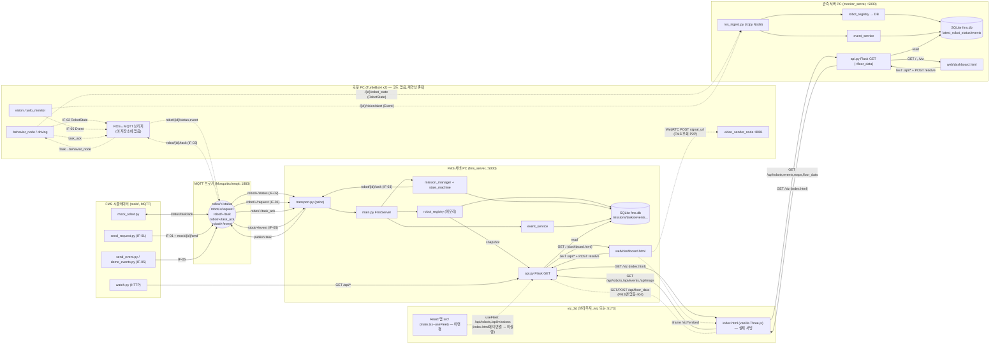

# 구성요소 분석 — fms_server · viz_3d · monitor_server

> 코드 정적 분석 결과. 추측 없이 실제 코드에 있는 것만 기록(없는 항목은 "없음").
> 대상: `fms_server/`, `viz_3d/`, `monitor_server/`
> 작성일: 2026-06-08

## 분석 전제: 세 폴더의 관계

세 폴더는 하나의 시스템이 아니라 **두 개의 독립 서버 구현 + 하나의 3D 뷰**다.

- **`fms_server`** — MQTT 기반 **능동 제어 서버**(미션 생성·task 발행). 핵심.
- **`monitor_server`** — ROS2 기반 **수동 관측 서버**(미션·제어 없음). `fms_server`를 관측 전용으로 재구성한 변형판. 같은 파일명(api.py/db.py/config.py 등)을 공유하지만 내부가 다름.
- **`viz_3d`** — 3D 관제 화면. 두 서버 모두 `/viz`로 서빙. 단, 실제 서빙되는 것은 vanilla `index.html`이고 React 소스(`src/`)는 진입점에 연결돼 있지 않음(불일치 #1 참조).

기준 계약: `alfred_interfaces`(ROS `.msg`)가 IF-01~05의 원본.

---

# 1부. 구성요소별 요약

## A. fms_server (MQTT 제어 서버)

### A-1. `main.py` (FmsServer)
1. **이름/목적**: FMS 조립·기동. MQTT 연결·구독, Flask 스레드, 타임아웃 감시 스레드 기동.
2. **입력 (MQTT 구독, 와일드카드)**:
   - `robot/+/status` (IF-02, dict) → `_on_status`
   - `robot/+/request` (IF-01, dict) → `_on_request`
   - `robot/+/task_ack` (dict) → `_on_ack`
   - `robot/+/event` (IF-05, dict) → `_on_event`
   - OS 시그널 SIGINT/SIGTERM
3. **출력**: 직접 발행 없음(하위 모듈에 위임). 스레드(Flask, status-watch) 기동.
4. **핵심 제어 흐름**:
   - status 수신 → `registry.update_from_status` + `missions.on_robot_status` 둘 다 호출
   - 감시 스레드: `_stop.wait(STATUS_WATCH_INTERVAL)` 주기로 `missions.check_timeouts()` (sleep 폴링 아님, 이벤트 대기)
5. **파라미터**: `STATUS_WATCH_INTERVAL`(1.0s), QOS 상수.
6. **의존**: transport, registry, missions(MissionManager), event_service, api, db.
7. **불일치**: docstring은 "현재 단계(M0): db 초기화 + MQTT 연결까지"라 하나 실제는 M3까지(FSM·예외·API) 전부 연결됨 → docstring이 옛 단계 그대로.

### A-2. `config.py`
1. **목적**: 브로커·토픽·QoS·타임아웃·POI·로그인 상수 단일 출처.
2. **입력**: 환경변수(`FMS_MQTT_HOST/PORT`, `FMS_STATUS_TIMEOUT`, `FMS_FLASK_PORT`, `FMS_ADMIN_*` 등), `poi_table.yaml`.
3. **출력**: 토픽 빌더(`topic_status/request/event/task/task_ack`), 와일드카드, QoS, `ROBOTS`, `partner_of()`.
4. **핵심 흐름**: `partner_of(robot_id)` → 2대 전제에서 나머지 1대 반환(없으면 None).
5. **파라미터**: `PROTOCOL_VERSION="2.1"`, `STATUS_TIMEOUT=10.0`, `HANDOVER_TARGET_MS=3000`, `TASK_ACK_TIMEOUT=3.0`, robot2 base `station` / robot4 base `station2`.
6. **의존**: 모든 FMS 모듈.
7. **불일치**: `ros_domain_id`는 주석상 "FMS가 안 쓰는 정보 필드" — 코드 일관됨.

### A-3. `transport.py` (MqttTransport)
1. **목적**: paho-mqtt 의존을 한 파일에 격리한 JSON pub/sub 래퍼.
2. **입력**: `subscribe(topic_filter, handler, qos)`, paho 콜백.
3. **출력**: `publish(topic, payload_dict, qos)` → JSON 직렬화 후 발행.
4. **핵심 흐름**: 연결 전 subscribe는 `_subscriptions`에 보관 → `_on_connect`에서 일괄 재구독(재접속 대응). 핸들러 예외·비-JSON 메시지는 격리/폐기.
5. **파라미터**: host/port/keepalive/client_id.
6. **의존**: config. FMS·모든 시뮬레이터 도구가 공유.
7. **불일치**: 없음.

### A-4. `states.py`
1. **목적**: Robot(10)/Mission(9)/task_type(4)/task_status(4)/ack(2)/event_type(3) enum 상수.
2-3. 입출력: 상수 모음.
4. **핵심**: `ESCORT_TASK_TYPES = {ESCORT_TO_HANDOVER, ESCORT_TO_FINAL}`.
7. **불일치(주석 명시)**: `EVENT_EMERGENCY_PATIENT`는 정의서 v2.1(FIRE|SUSPICIOUS_PERSON)·`Event.msg`에 없는 확장 → 실제 불일치.

### A-5. `messages.py`
1. **목적**: IF-01~05 + task_ack 빌더. 공통 필드(`msg_id`/`version`/`timestamp`) 자동 부착.
3. **출력 (MQTT JSON 구조)**:
   - `if02`: `{robot_id, state, pose:{x,y,theta}, battery, current_task_id, task_status, error_code}` + envelope
   - `if03`: `{task_id, robot_id, task_type, goal:{poi_id,floor,pose}, customer:{}, mission_id, cancel_task_id}` + envelope
   - `if01`: `{request_id, robot_id, request_type, destination:{poi_id,floor}, origin:{floor,pose}, customer, target_request_id}` + envelope
   - `if05`: `{event_type, robot_id, confidence, location:{x,y,floor}, snapshot_ref}` + envelope
   - `task_ack`: `{task_id, robot_id, result}` + envelope
6. **의존**: config, db. FMS와 mock_robot 공유 → 형식 일치 보장.
7. **불일치(중요)**: 빌더 JSON은 **nested**(`goal`/`destination`/`origin`/`customer`/`location`), `alfred_interfaces` .msg는 **flat**(`goal_poi_id/goal_pose/goal_floor`, `dest_poi_id/dest_floor`, `customer_id/profile/language`). 브리지 변환 필요(2부 표).

### A-6. `robot_registry.py` (RobotRegistry)
1. **목적**: 로봇별 최신 IF-02 스냅샷(메모리) + 전이 시 DB 적재 + 미수신 감시.
2. **입력**: `update_from_status(payload)`.
3. **출력**: 메모리 스냅샷, `robot_status_log` INSERT(변화 시만), `snapshot/all_snapshots/stale_robots`.
4. **핵심 흐름**: prev_state≠state 또는 prev_task_status≠task_status 또는 최초 → 변화로 간주 로그. enum 밖 state는 경고만(절대규칙 5). `stale_robots`: `now-last_seen > STATUS_TIMEOUT`.
6. **의존**: db, config, states.
7. **불일치**: 없음.

### A-7. `state_machine.py`
1. **목적**: Mission 전이표를 순수 데이터로 보유.
2-3. `next_state(current,event)`, `exception_state(event)`.
4. **핵심 전이표**:
   - `REQUESTED→(ASSIGN)→ASSIGNED`
   - `ASSIGNED→(DISPATCH_HANDOVER)→ESCORTING_TO_HANDOVER` / `ASSIGNED→(DISPATCH_FINAL_DIRECT)→ESCORTING_TO_FINAL`
   - `ESCORTING_TO_HANDOVER→(START_ARRIVED)→HANDOVER_WAITING`
   - `HANDOVER_WAITING→(HANDOVER_APPROVED)→ESCORTING_TO_FINAL`
   - `ESCORTING_TO_FINAL→(FINAL_ARRIVED)→COMPLETED`
   - 예외(ACTIVE_STATES에서만): CANCEL→CANCELLED, EMERGENCY→EMERGENCY, FAIL→FAILED
7. **불일치**: 없음.

### A-8. `mission_manager.py` (MissionManager) — 핵심 로직
1. **목적**: IF-01 → 미션 생성·배정 → IF-03 발행, IF-02 task 완료로 전이, 핸드오버 승인·3초 측정, 예외 처리.
2. **입력**: `on_request(if01)`, `on_robot_status(if02)`, `on_task_ack(ack)`, `check_timeouts()`.
3. **출력**: `transport.publish(topic_task(robot_id), if03_msg)`, DB(missions/requests/tasks/mission_transitions) 적재.
4. **핵심 제어 흐름**:
   - `on_request`: CANCEL→`_on_cancel`; ESCORT→`_create_escort`; 그 외 무시
   - `_create_escort`: dest poi 미존재 또는 robot_id 미등록 → ERROR 후 무시. same_floor(dest.floor==origin.floor) 판정
     - **같은 층**: ASSIGNED→ESCORTING_TO_FINAL, start에 `ESCORT_TO_FINAL`
     - **층 다름**: next에 `MOVE_TO_STANDBY`, start에 `ESCORT_TO_HANDOVER`, ESCORTING_TO_HANDOVER
   - `on_robot_status`: 활성 미션이면 **예외 우선**(state=EMERGENCY→미션 EMERGENCY; task_status=FAILED→미션 FAILED). 정상은 발행 task가 SUCCEEDED로 **처음** 보고될 때 1회 반응
     - MOVE_TO_STANDBY 완료 → `next_ready=True`
     - ESCORT_TO_HANDOVER 완료 → `start_arrived=True`, `t_arrival=payload.timestamp`, HANDOVER_WAITING
     - 둘 다 충족 → latency 계산·DB 기록 → ESCORTING_TO_FINAL, next에 `ESCORT_TO_FINAL`, start에 `RETURN_TO_BASE`
     - ESCORT_TO_FINAL 완료 → COMPLETED, 도착 로봇 `RETURN_TO_BASE`, 로봇 해제
   - `on_task_ack`: REJECT 且 활성 → 미션 FAILED(재배정 없음)
   - `check_timeouts`: stale 로봇 → 활성 미션 FAILED + 로봇 ERROR(중복 방지 `_timed_out`)
   - `_terminate`: 종결 전이 + 진행 task에 `RETURN_TO_BASE`(cancel_task_id 부착). 단 emergency/silent 로봇엔 미발행
5. **파라미터**: `HANDOVER_TARGET_MS=3000`(측정·증빙용, 차단 아님).
6. **의존**: transport, registry, db, messages, poi, state_machine, config.
7. **불일치**: `_set_state`가 전이표와 어긋나면 경고 로그(자체 정합 검증). same_floor 미션은 next_robot 미점유 → 해제 루프가 next까지 도는 건 무해. 코드-주석 어긋남 없음.

### A-9. `poi.py`
1. **목적**: poi_id → IF-03 goal(`{poi_id,floor,pose}`) 변환, type별 조회.
2-3. `get/by_type/first_of_type/goal_for`, 캐시 + `reload()`.
6. **의존**: config, mission_manager.
7. **불일치**: `first_of_type`는 dict 첫 항목 사용 → 현 poi_table엔 type별 1개라 결정적이나 다수 시 순서 의존(잠재 위험, 현 데이터 무해).

### A-10. `db.py`
1. **목적**: SQLite(WAL) 스키마·적재(기록 전용).
2-3. 테이블 `requests/missions/mission_transitions/tasks/robot_status_log/events`. `execute/query_all/query_one`, `_migrate`.
5. **파라미터**: `DB_PATH`(기본 `./fms.db`), WAL/synchronous=NORMAL.
7. **불일치**: 없음.

### A-11. `event_service.py`
1. **목적**: IF-05 → `events` INSERT(미션과 무관).
3. **출력**: `events(event_type, robot_id, confidence, x, y, floor, snapshot_ref, at)`.
4. **핵심**: event_type/robot_id 없으면 폐기, enum 밖이면 경고만.
7. **불일치**: FMS events엔 `msg_id`/`event_class` 컬럼 없음(monitor엔 있음).

### A-12. `api.py` (Flask, 읽기 전용 GET)
1. **목적**: 대시보드 서빙 + 조회 API + 로그인 가드.
2. **입력 (HTTP)**: `POST /login`, `GET /logout`, `POST /api/events/<id>/resolve`(유일한 쓰기 예외=관제사 ack), 다수 GET.
3. **출력 (엔드포인트)**: `/`(dashboard.html), `/viz`(viz_3d/index.html), `/api/maps`, `/maps/<f>`, `/api/video_sources`, `/api/health`, `/api/robots`(메모리 스냅샷), `/api/missions`(+active), `/api/missions/<id>`(+transitions+tasks), `/api/events`(active 필터), `/api/search`, `/api/stats`(p95·성공률), `/api/system`(MQTT TCP·DB·로봇 온라인), `/api/robot_log`, `/api/transitions`, `/api/requests`, `/api/control_stats`.
4. **핵심 흐름**: `before_request` 가드 — `/login`·`/logout` 공개, 세션 없으면 `/api/*`·`/maps/*`는 401, 그 외 `/login` 리다이렉트.
5. **파라미터**: `FLASK_HOST=0.0.0.0`, `FLASK_PORT=5000`, `ADMIN_USER/PASSWORD`, `CORS_ORIGINS`.
6. **의존**: registry(메모리), db. viz_3d/dashboard.html이 폴링.
7. **불일치**: `/api/floor_data` 엔드포인트 없음 — 그런데 서빙하는 `index.html`은 `/api/floor_data` GET/POST 호출 → FMS 서빙 시 404(코드상 catch·localStorage 폴백). monitor에만 존재.

### A-13. 도구(`tools/`)
- **`mock_robot.py`**: 가짜 로봇. 입력 `robot/{id}/task`(구독), `mock/{id}/cmd`(call/idle/emergency/fail/recover/mute/unmute). 출력 `robot/{id}/status`(IF-02 주기), `robot/{id}/task_ack`. 거절: `--reject-when-idle` 且 ESCORT task 且 PATROL/IDLE → REJECT.
- **`send_request.py`**: Interaction 시뮬. 출력 `mock/{id}/cmd {cmd:call}` → `robot/{id}/request`(IF-01 ESCORT/CANCEL).
- **`send_event.py`**: Vision 시뮬. 출력 `robot/{id}/event`(IF-05 단건).
- **`demo_events.py`**: IF-05 일괄 발행(랜덤) → `robot/{id}/event`.
- **`watch.py`**: 터미널 대시보드. 입력 HTTP GET `/api/robots`, `/api/missions`, `/api/events?limit=3`, `/api/missions/<id>`.
- **`build_maps.py`**: `docs/maps/*.pgm+yaml` → `web/maps/*.png + maps.json`.
- **`echo_test.py`**, **`integration_test.py`**: M0 왕복·통합 회귀 테스트.

---

## B. monitor_server (ROS2 관측 서버)

> 미션 생성·task 발행 전혀 없는 관측 전용. `main.py`: "does not create missions, publish robot tasks, or control robot behavior."

### B-1. `main.py` (MonitorServer)
1. **목적**: ROS2 ingest 노드 + 대시보드 API 기동.
2. **입력**: ROS2 메시지(노드 경유), SIGINT/SIGTERM.
3. **출력**: Flask 스레드, `rclpy.spin`.
4. **핵심 흐름**: `rclpy.init` → `RosIngestNode` → Flask 스레드 → `rclpy.spin`. transport/mission/state_machine 없음.
6. **의존**: rclpy, ros_ingest, robot_registry, api, db.
7. **불일치**: `RosIngestNode(registry)`는 생성·Flask에 registry 전달하지만, api는 DB(`latest_robot_status`)에서 읽음 → registry 객체 api 미사용(인자 잔재).

### B-2. `ros_ingest.py` (RosIngestNode)
1. **목적**: ROS2 구독 → SQLite 적재.
2. **입력 (ROS2 토픽, robot_id별)**:
   - `/{robot_id}/robot_state` (`alfred_interfaces/msg/RobotState`)
   - `/{robot_id}/vision/alert` (`alfred_interfaces/msg/Event`)
3. **출력**: `registry.update_from_ros_state(msg)`, `event_service.record_event({...})`.
4. **핵심 흐름**: msg → dict(getattr 방어적). Event는 `event_class`/`class_name` 여러 후보 필드 시도.
5. **파라미터**: `ROS_QOS_STATUS=10`, `ROS_QOS_EVENT=10`.
6. **의존**: rclpy, config, event_service, robot_registry, alfred_interfaces.
7. **불일치(중요)**:
   - 구독 토픽 `/{id}/robot_state`, `/{id}/vision/alert`는 monitor config 자체 가정. `.msg` 주석은 IF-02=`robot/{id}/status`(MQTT), IF-05=`robot/{id}/event` → 실제 로봇 ROS 토픽명과 일치 **불명확**.
   - `Event.msg`에 `event_class`/`class_name` 필드 없음 → 항상 None → `events.event_class` 비게 됨.

### B-3. `config.py`
- `ROBOTS`: robot2(floor 1)/robot4(floor 2), `namespace`/`ros_domain_id`/`floor`. POI base_poi·partner_of 없음.
- `ros_robot_state_topic`, `ros_event_topic`, `ROS_QOS_*`. MQTT 토픽 함수 없음.
7. **불일치**: `POI_TABLE_PATH`/`load_poi_table` 존재하나 dispatch에 미사용(잔재).

### B-4. `robot_registry.py` (RobotRegistry)
1. **목적**: ROS RobotState → `latest_robot_status` upsert + 변화 시 `robot_status_log`.
2. **입력**: `update_from_status(payload)`, `update_from_ros_state(msg)`.
3. **출력**: `latest_robot_status`(robot_id PK upsert) + `robot_status_log`(변화 시).
4. **핵심**: FMS와 달리 메모리 스냅샷이 아니라 **DB 테이블**에 최신값 저장(`ON CONFLICT DO UPDATE`). floor는 config 보강.
7. **불일치**: FMS 절대규칙 6("DB는 통신수단 아님")과 달리 latest_robot_status를 조회 경로로 사용 → 설계 방침이 FMS와 다름.

### B-5. `event_service.py`
- FMS와 유사하나 INSERT에 `msg_id`, `event_class` 포함.

### B-6. `db.py`
- 테이블: `latest_robot_status`, `robot_status_log`, `events`(+msg_id/event_class), `ui_usage_log`, `monitor_counters`. missions/tasks/requests/mission_transitions 없음.

### B-7. `api.py`
- 엔드포인트: `/`, `/viz`, `/api/maps`, **`/api/floor_data`(GET+POST)**, `/maps/<f>`, `/api/video_sources`, `/api/health`, `/api/robots`(DB `latest_robot_status`), `/api/events`, `POST /api/events/<id>/resolve`, `/api/robot_log`, `/api/search`(events/status), `/api/stats`, `/api/system`(ROS mode=direct·토픽 목록), `/api/control_stats`.
- `/api/missions`·`/api/transitions`·`/api/requests` 없음(미션 개념 없음).
7. **불일치**: `/api/stats`·`/api/control_stats`는 `ui_usage_log`/`monitor_counters` 기반인데, 이 테이블에 **쓰는 코드가 ingest 경로에 없음** → 승객·언어·교통약자 카운터 항상 0(외부 주입 전제로 보이나 코드상 미연결).

---

## C. viz_3d (3D 관제 뷰)

### C-1. `index.html` (vanilla Three.js r128) — 실제 서빙되는 앱
1. **목적**: 1/2/통합층 3D 뷰 + 로봇 실시간 위치 + 이상감지 비콘 + 맵 편집기.
2. **입력 (HTTP GET 폴링)**:
   - `/api/robots` (1s)
   - `/api/events?active=1&limit=50` (2s) — 이상감지 비콘
   - `/api/maps` — 맵 메타(origin/resolution/width/height)
   - `/api/floor_data` (GET) — 평면도 편집 데이터
   - `?ros=ws://IP:9090` (선택) — rosbridge `/{id}/amcl_pose` 직접 구독
3. **출력**: `POST /api/floor_data`(맵 편집 저장, debounce 250ms), `/logout`.
4. **핵심 흐름**: `pollRobots`→`rosToScene(floor,x,y)` 좌표 변환·trail 누적. `pollEvents`→active 이벤트만 비콘 생성/소멸. `ROBOT_FLOOR={robot2:1, robot4:2}`.
5. **파라미터**: `PLATE`(층 크기), `FSCALE`, `MAP_META`(transform.ts와 동일 값), `LS_KEY=fms_floor_data_v6`.
6. **의존**: FMS/monitor의 `/api/robots`·`/api/events`·`/api/maps`·`/api/floor_data`.
7. **불일치**: `/api/floor_data`는 monitor에만 존재(FMS엔 없음). 상단바 "rosbridge 연결됨"은 정적 텍스트(실연결 무관).

### C-2. React/Vite 소스(`src/main.tsx`, `App.tsx`, `Scene.tsx`, `useFleet.ts`, `mock.ts`, `cctv.ts`, `transform.ts`, `floorplan.ts`, `ui/*`)
1. **목적**: README가 설명하는 React+R3F 앱(로봇·사람·CCTV·경로).
2. **입력 (useFleet)**: `/api/robots`, `/api/missions`(역할 start/next 추출), `/login`(401 시 1회 재로그인).
3. **출력**: 없음. 사람=mock, CCTV=정적(cctv.ts).
4. **핵심 흐름**: 1s 폴링 → 실패 시 mock 폴백. 미션 active[0]의 start_robot/next_robot로 역할 부여.
6. **의존**: FMS `/api/robots`·`/api/missions`.
7. **불일치(가장 중요)**: `index.html`에 `<script type="module" src="/src/main.tsx">`도 `
`도 없음(index.html은 `id="app"` 사용). `dist/`에도 번들 JS 없이 vanilla `index.html` 1개만 빌드됨. → **React 앱 전체가 어떤 HTML에도 연결되지 않아 실제 실행되지 않음.** README·package.json·vite.config은 React 전제지만 배포 실체는 vanilla index.html.

---

# 2부. 입출력 대조 (모듈 간 짝 맞춤)

## 2-1. FMS ↔ 로봇(mock) — MQTT (내부 정합 양호)

messages.py/config.py/states.py 공유로 토픽·필드 일치.

| 채널(토픽) | 보내는 쪽 | 받는 쪽 | 일치? |
|---|---|---|---|
| `robot/{id}/status` (IF-02) | mock_robot `_publish_status` | FMS `_on_status` | ✅ |
| `robot/{id}/request` (IF-01) | send_request | FMS `_on_request` | ✅ |
| `robot/{id}/task` (IF-03) | FMS `_issue_task` | mock_robot `_on_task` | ✅ |
| `robot/{id}/task_ack` | mock_robot `_on_task` | FMS `_on_ack` | ✅ |
| `robot/{id}/event` (IF-05) | send_event/demo_events | FMS `_on_event` | ✅ |
| `mock/{id}/cmd` | send_request | mock_robot `_on_cmd` | ✅ (테스트 전용, 계약 외) |

## 2-2. FMS MQTT JSON ↔ alfred_interfaces .msg (브리지 변환 지점 — 구조 불일치)

| 항목 | FMS JSON(messages.py) | ROS .msg | 불일치 |
|---|---|---|---|
| IF-03 목표 | `goal:{poi_id,floor,pose}` (nested) | `goal_poi_id`, `goal_pose`, `goal_floor` (flat) | **구조 다름** — 브리지 변환 필요 |
| IF-03 고객 | `customer:{}` (nested) | `customer_id`, `customer_profile`, `customer_language` (flat) | **구조 다름** |
| IF-01 목적지 | `destination:{poi_id,floor}`, `origin:{floor,pose}` | `dest_poi_id`, `dest_floor`, `origin_floor`, `origin_pose` | **구조 다름** |
| IF-05 위치 | `location:{x,y,floor}` | `location`(Pose2D x,y,theta) + `floor`(별도 int) | **floor 위치 다름** |
| event_type | `EMERGENCY_PATIENT` 허용(states) | `Event.msg`=FIRE\|SUSPICIOUS_PERSON만 | **enum 불일치(주석 명시)** |
| version | `version="2.1"` 부착 | .msg에 version 필드 없음 | 한쪽만 보냄 |
| msg_id | envelope에 포함 | RobotState/Event 등에 `timestamp`만 있음 | 부분 불일치 |

> 브리지(robot↔FMS) 코드가 이 세 폴더에 없음 → 실제 변환 정합 여부 **불명확**. .msg 주석상 "브리지가 재발행" 전제.

## 2-3. monitor_server ROS 구독 ↔ .msg / 로봇

| 항목 | monitor 기대 | 실제(.msg/로봇) | 불일치 |
|---|---|---|---|
| 상태 토픽 | `/{id}/robot_state` | RobotState.msg 주석: `robot/{id}/status`(MQTT) | 토픽명 **불명확**(monitor 자체 가정) |
| 이벤트 토픽 | `/{id}/vision/alert` | Event.msg 주석: `robot/{id}/event` | 토픽명 **불명확** |
| 이벤트 class | `event_class`/`class_name` 읽음 | Event.msg에 필드 **없음** | 받는 필드가 송신에 없음 → 항상 None |
| RobotState.pose | `Pose2D(x,y,theta)` | 일치 | ✅ |

## 2-4. viz_3d ↔ 서버 API

| viz가 호출 | FMS api.py | monitor api.py | 불일치 |
|---|---|---|---|
| `GET /api/robots` | ✅ | ✅ | OK |
| `GET /api/events?active=1` | ✅ | ✅ | OK |
| `GET /api/maps` | ✅ | ✅ | OK |
| `GET/POST /api/floor_data` (vanilla index.html) | ❌ 없음 | ✅ | **FMS 서빙 시 404**(catch됨) |
| `GET /api/missions` (React useFleet) | ✅ | ❌ 없음 | React를 monitor에 붙이면 404 — 단 React 미실행 |
| events 좌표 필드 | `events.x/y/floor` ✅ | `events.x/y/floor` ✅ | viz는 `ev.x,ev.y,ev.floor,ev.id` 사용 → 양쪽 충족 |

## 2-5. 대시보드(dashboard.html) ↔ 서버 API

| | 호출 엔드포인트 | 서버 제공 | 불일치 |
|---|---|---|---|
| FMS dashboard | system/stats/control_stats/transitions/robot_log/requests/missions/events/maps/video_sources/events·resolve | FMS api 전부 제공 | ✅ |
| monitor dashboard | robots/events/stats/system/search/robot_log/video_sources/events·resolve | monitor api 전부 제공 | ✅ (missions·transitions 호출 안 함 — 정합) |

## 2-6. 한쪽만 존재(짝 없음)

| 항목 | 상태 |
|---|---|
| FMS `/api/stats`·`/api/control_stats`의 language/profile | missions에 profile/language 적재됨 → 동작 ✅ |
| monitor `/api/stats`의 `ui_usage_log`/`monitor_counters` | **쓰는 코드 없음** → 항상 0 (받기만 함) |
| monitor `RobotRegistry` 객체를 api에 전달 | api는 DB로 조회 → 인자 미사용 |
| viz React 전체(main.tsx~useFleet) | index.html이 연결 안 함 → 소비처 없음(dead) |
| `mock/{id}/cmd` | 계약 외 테스트 채널 — 실로봇엔 짝 없음(의도) |

---

# 3부. 연결 다이어그램 (Mermaid flowchart LR)

실선 = 코드 확인 연결, 점선 = 미확정/조건부(브리지 미존재, 토픽명 가정, 미실행 경로).

---

# 핵심 발견 요약 (불일치 우선순위)

1. **viz_3d React 앱이 죽은 코드** — `index.html`(vanilla)이 실제 서빙물이고 `src/main.tsx` 이하 React 전체가 어떤 HTML에도 연결돼 있지 않음. README/package.json은 React 전제. (가장 큰 코드-문서 괴리)
2. **`/api/floor_data`가 FMS엔 없음** — vanilla viz는 호출하지만 FMS 서빙 시 404(catch). monitor에만 존재.
3. **MQTT JSON(nested) ↔ ROS .msg(flat) 구조 불일치** — `goal`/`destination`/`customer`/`location`. 브리지 변환 필수인데 브리지 코드가 저장소에 없어 검증 불가(불명확).
4. **`EMERGENCY_PATIENT`** — FMS states는 허용, `Event.msg`/정의서는 미정의(주석에 명시된 확장).
5. **monitor `event_class`** — 읽지만 `Event.msg`에 필드 없음 → 항상 None.
6. **monitor `ui_usage_log`/`monitor_counters`** — 읽지만 쓰는 코드 없음 → 카운터 항상 0.
7. **monitor ROS 토픽명**(`/{id}/robot_state`, `/{id}/vision/alert`)이 로봇 실제 토픽과 일치하는지 불명확.
8. **포트 충돌 주의** — FMS·monitor 둘 다 `:5000`, DB 기본 `./fms.db`. 같은 호스트 동시 구동 시 포트 충돌(파일은 각 디렉터리라 분리).
