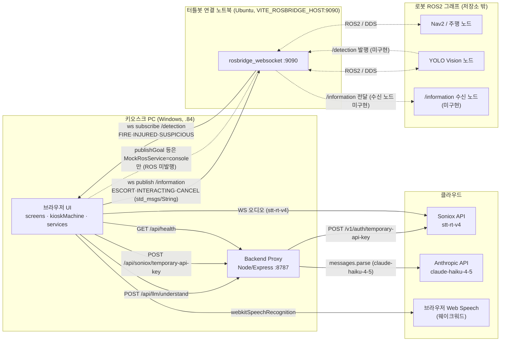

# alfred_interaction 코드 구성요소 분석

> 실제 코드(`server/`, `src/`)에서 확인된 것만 정리. 미확인은 "없음" 또는 "불명확"으로 표시.

## 0. 호스트 구성 (코드로 확인된 것)
- **키오스크 PC (Windows, 192.168.107.84)**: 브라우저 UI(Vite) + 백엔드 프록시(Node `:8787`). Vite가 `/api`→`localhost:8787` 포워딩(`vite.config.ts`).
- **터틀봇 연결 노트북 (Ubuntu, `VITE_ROSBRIDGE_HOST`)**: `rosbridge_websocket :9090`. 그 너머 로봇 ROS2 그래프(Nav2/YOLO)는 **이 저장소 밖**.
- **클라우드**: Soniox API, Anthropic API, (웨이크워드용) 브라우저 Web Speech.

---

# 1. 구성요소별 분석

## A. 네트워크 경계 컴포넌트

### A-1. Backend Proxy (`server/proxy.mjs`)
1. **이름/목적**: Soniox·Anthropic 키를 브라우저에서 숨기는 Express 프록시.
2. **입력(HTTP)**:
   - `POST /api/llm/understand` body `{transcript:string, language?:string, candidates:Array<{poi_id,name,floor,aliases}>}`
   - `POST /api/soniox/temporary-api-key` (body 무시)
   - `GET /api/health`
3. **출력**:
   - `/understand` → `{intent:'facility'|'chat', poi_id:string|null, confidence:number, reply:string, language:'ko'|'en'|'ja'|'zh'}` (Zod 검증). 에러 400/500/502
   - `/temporary-api-key` → `{api_key, expires_at}` (500/502)
   - `/health` → `{ok, soniox:bool, anthropic:bool, model}`
   - 외부 호출: Anthropic `messages.parse()`(model `claude-haiku-4-5`); Soniox REST `POST https://api.soniox.com/v1/auth/temporary-api-key` body `{usage_type:'transcribe_websocket', expires_in_seconds:TTL}`, `Bearer SONIOX_API_KEY`
4. **제어흐름**: `/understand`: transcript 공백→400 → Anthropic parse → `parsed_output` 없음→502 → 200. `/temp-key`: `SONIOX_API_KEY` 없음→500 → Soniox fetch `!ok`→502 → 200.
5. **설정**: `PORT`(8787), `SONIOX_API_KEY`, `ANTHROPIC_API_KEY`, `SONIOX_TEMP_KEY_TTL`(300), `LLM_MODEL`(`claude-haiku-4-5`), `express.json limit 1mb`, `cors()` 전체 허용.
6. **의존**: 받음 ← 브라우저(`SonioxSttService`, `ClaudeLlmService`). 줌 → Anthropic API, Soniox API.
7. **코드/문서 불일치**: 헤더 주석이 경로를 `user_interface/.env`로 적음 → 실제는 `src/alfred_interaction`. `RUN.md`도 옛 경로 `C:\Rokey_turtlebot\user_interface` 사용. 헤더 주석은 엔드포인트 2개만 적음(`/api/health` 누락).

### A-2. SonioxSttService (`src/services/stt/SonioxSttService.ts`)
1. **목적**: Soniox `stt-rt-v4` 실시간 STT + 라우드니스 노이즈 게이트.
2. **입력**: 마이크 `getUserMedia`; 프록시 temp-key `fetch(POST temporaryKeyEndpoint)`; Soniox WS 콜백 `onPartialResult/onFinished/onError`.
3. **출력**: `SttHandlers.onResult({transcript,isFinal})`, `onError`, `onEnd`. 외부: 게이트된 오디오 스트림을 `SonioxClient.start({stream})`로 Soniox WS 전송.
4. **제어흐름**: `getUserMedia` 실패→`onError`+end → `createNoiseGate(gateDb)` → `client.start`. partial: `is_final` 토큰 `finalText` 누적/그 외 interim→`onResult(false)`. `onFinished`→`onResult(true)`+end. `stop()`→`client.stop()`+gate close.
5. **설정**: `model`(stt-rt-v4), `gateDb`(env -45), `GATE_HOLD_MS`(300), `languageHints`(선택언어 우선+전체), `enableLanguageIdentification:true`.
6. **의존**: 받음 ← `useVoiceFlow`. 줌 → 프록시 temp-key, Soniox WS(클라우드).
7. **불일치**: 없음.

### A-3. ClaudeLlmService (`src/services/llm/ClaudeLlmService.ts`)
1. **목적**: 프록시 통해 발화 이해(시설 vs 잡담 + POI).
2. **입력**: `understand(transcript, candidates:Facility[], {language})`.
3. **출력**: `POST endpoint` body `{transcript, language, candidates:[{poi_id:c.poiId, name, floor:c.floorId, aliases}]}` → 반환 `VoiceUnderstanding{intent, facility, confidence, reply, language}`.
4. **제어흐름**: fetch `!ok`→throw → `ProxyResponse` 파싱 → language 검증 → `poi_id`로 candidates에서 facility 매칭 → intent 결정.
5. **설정**: `endpoint`(`${apiBase}/llm/understand`).
6. **의존**: 받음 ← `useVoiceFlow`. 줌 → 프록시 `/api/llm/understand`.
7. **불일치**: 없음.

### A-4. RosBridgeClient (`src/services/ros/RosBridgeClient.ts`)
1. **목적**: rosbridge v2 프로토콜 WebSocket 클라이언트(자동재연결+오프라인 큐).
2. **입력**: WS `onmessage` 프레임 `{op:'publish',topic,msg}` → 구독 핸들러.
3. **출력(WS 프레임)**: `{op:'advertise',topic,type}`, `{op:'publish',topic,msg}`, `{op:'subscribe',topic}`, `{op:'unsubscribe',topic}`.
4. **제어흐름**: `onopen`→advertised 재전송+subscriptions 재구독+큐 flush. `send()`: open이면 전송, 아니면 큐(`maxQueue` 초과 시 오래된 것 drop)+connect. `onclose`→백오프 재연결(min→max).
5. **설정**: `url`(ws://HOST:PORT), `minReconnectMs`(1000), `maxReconnectMs`(15000), `maxQueue`(100).
6. **의존**: 받음 ← `RosBridgeFmsService`, `RosBridgeDetectionService`(공유 1인스턴스). 줌 → `rosbridge_websocket`(노트북:9090).
7. **불일치**: 없음.

### A-5. RosBridgeFmsService + `if01.ts` (`src/services/fms/`)
1. **목적**: IF-01 요청을 `/information`으로 publish.
2. **입력**: `sendRequest(If01Request)`.
3. **출력**: `bridge.publish('/information', toRosPayload(req, 'std_msgs/String'))` → `{data: JSON.stringify(req)}`. 페이로드 종류: **ESCORT** `{msg_id, version:'2.0', request_id, robot_id, request_type:'ESCORT', destination:{poi_id,floor}, origin:{floor,pose:{x,y}}, customer:{customer_id,profile,language}, timestamp}` / **INTERACTING**(=ESCORT에서 `destination` 없음) / **CANCEL** `{…,target_request_id}`.
4. **제어흐름**: `toRosPayload`로 감싸 publish + `console.info`.
5. **설정**: topic `/information`, msgType `std_msgs/String`, `IF_VERSION='2.0'`.
6. **의존**: 받음 ← `GuidanceProvider`(ESCORT/CANCEL), `PatrolScreen`(INTERACTING). 줌 → `RosBridgeClient`→`/information`.
7. **코드/문서 불일치**: `version='2.0'`인데 `if01.ts` 주석은 "정의서 v2.1 §2" 참조; (폐기 선언된) `docs/INTERFACE_CONTRACT.md`는 현재 버전 `"2.1"`. 또한 `if01.ts`/`FmsService.ts` 주석은 "MQTT/WebSocket FMS" 전제(폐기됨)인데 실제는 rosbridge `/information`.

### A-6. RosBridgeDetectionService + `detection.ts` (`src/services/detection/`, `src/core/domain/detection.ts`)
1. **목적**: YOLO 탐지 토픽 구독 → `DetectionType`.
2. **입력**: `bridge.subscribe(topics)` — `{data}`(std_msgs/String, 라벨 또는 JSON), `{type/event_type/label/class}`, bare string, 또는 토픽명.
3. **출력**: `onDetection(handler:(DetectionType)=>void)`.
4. **제어흐름**: 각 topic 구독 → `extractDetection`(`labelFromMessage`→`parseDetectionLabel`) `?? parseDetectionLabel(topic)` → 매칭 시 handler, 아니면 `console.debug`.
5. **설정**: `topics`(env `detectionTopics`=`['/detection']`), 별칭 `DETECTION_ALIASES`(fire/화재, injured/부상자, suspicious/거동수상자 …).
6. **의존**: 받음(소스) ← rosbridge `/detection`(로봇 Vision, **외부**). 줌 → `AlertsProvider`.
7. **불일치**: 없음(미확정 부분은 주석에 "이 한 곳에서 조정"으로 명시).

### A-7. WebSpeechTtsService (`src/services/tts/WebSpeechTtsService.ts`)
1. **목적**: 브라우저 `speechSynthesis` TTS.
2. **입력**: `speak(text, language, {onEnd, volume, rate, pitch})`, `cancel()`.
3. **출력**: 스피커 음성 + `onEnd` 콜백.
4. **제어흐름**: 미지원/빈 텍스트→`onEnd`. `cancel()` 후 utterance(lang/volume/rate/pitch) speak. `onend/onerror`→`onEnd`.
5. **설정**: `LANG_TAG`(ko-KR…). (AlertScreen 호출 시 volume 1, rate 1.02, ko)
6. **의존**: 받음 ← `useSpeak`(VI 모드 게이트), `AlertScreen`(직접). 줌 → 브라우저 speechSynthesis.
7. **코드/문서 불일치**: `TtsService.ts`/`useSpeak.ts` 주석 "VI 모드에서만 발화"인데 **AlertScreen은 `useSpeak`를 우회해 모드 무관하게 직접 `tts.speak` 호출**(경보는 의도적 항상 발화).

### A-8. useWakeWord (`src/core/hooks/useWakeWord.ts`)
1. **목적**: 브라우저 Web Speech로 "hello alfred/헬로 알프레드" 감지.
2. **입력**: 마이크(`webkitSpeechRecognition`, 클라우드), `phrases`.
3. **출력**: `onWake()` 콜백.
4. **제어흐름**: enabled+지원 시 인식 시작, `onresult` 매칭→`onWake`+stop, `onend`→400ms 후 재시작.
5. **설정**: `LANG_TAG`, `continuous/interimResults=true`.
6. **의존**: 받음 ← `PatrolScreen`(`onWake`→`WAKE_VOICE`). 줌 → 브라우저 Web Speech(클라우드).
7. **불일치**: 없음.

## B. 오케스트레이션 컴포넌트

### B-1. Kiosk 상태머신 (`src/core/kiosk/kioskMachine.ts`)
1. **목적**: 화면/모드 유한상태기(순수 reducer).
2. **입력**: `KioskEvent`(dispatch).
3. **출력**: `KioskState{screen, mode, staffCallActive, session, alert}`.
4. **제어흐름(주요 분기)**: `WAKE` patrol→home / `WAKE_VOICE` patrol→voice+mode=VI / `OPEN_MAP` home→map / `OPEN_VOICE` home→voice / `GO_HOME` map·voice→home / `START_GUIDING`→guiding(+session) / `UPDATE_PROGRESS`→session.progress / `END_GUIDING`→initial / `IDLE_TIMEOUT`→guiding이면 유지·아니면 initial / `OPEN·CLOSE_STAFF_CALL` 토글 / `DETECTION`→alert(+alert, staffCallActive:false) / `CLEAR_ALERT`→alert면 initial.
5. **설정**: `initialKioskState`(patrol/general/false/null/null).
6. **의존**: 받음 ← 모든 화면·Provider(dispatch). 줌 → `KioskRouter`(screen)·화면들(state).
7. **불일치**: 머신 다이어그램 주석에 `alert` 화면 미반영(경미).

### B-2. GuidanceProvider (`src/features/guiding/GuidanceProvider.tsx`)
1. **목적**: 에스코트 오케스트레이션(Navigation↔상태머신, IF-01 발행).
2. **입력**: `guideTo(facility)`, `cancelGuidance()`.
3. **출력**: `fms.sendRequest(buildEscortRequest{...})`(poiId 있을 때만), `fms.sendRequest(buildCancelRequest)`; `navigation.planRoute/start`; dispatch `START_GUIDING/UPDATE_PROGRESS/END_GUIDING`.
4. **제어흐름**: `guideTo`: 기존취소→`planRoute`→poiId 있으면 ESCORT 발행(`request_id` 저장)→`START_GUIDING`→`navigation.start`(onProgress→`UPDATE_PROGRESS`; `arrived`면 `arrivedHoldMs` 후 `END_GUIDING`). `cancelGuidance`: navigation 취소+CANCEL 발행+`END_GUIDING`.
5. **설정**: `kioskConfig.robotId`, `originPose`, `arrivedHoldMs`(2600); `customer.profile`=VI면 `VISUALLY_IMPAIRED`/else `GENERAL`.
6. **의존**: 받음 ← `MapScreen`·`VoiceScreen`(guideTo), `GuidingScreen`(cancel). 줌 → `FmsService`(/information), `NavigationService`, 상태머신.
7. **코드/문서 불일치**: 주석 "tell the FMS"지만 FMS 채널은 폐기·실제 rosbridge `/information`. `poiId` 없으면 ESCORT 미발행+`console.error`.

### B-3. AlertsProvider (`src/features/alerts/AlertsProvider.tsx`)
1. **목적**: 탐지 구독→경보 dispatch, 수동 트리거.
2. **입력**: `detection.onDetection` 콜백; `window.alfredAlert/alfredClearAlert`.
3. **출력**: dispatch `DETECTION{detection}`, `CLEAR_ALERT`.
4. **제어흐름**: mount 시 `onDetection` 구독→`DETECTION` dispatch; `window` 훅 등록/해제.
5. **설정**: 없음.
6. **의존**: 받음 ← `DetectionService`(/detection). 줌 → 상태머신.
7. **불일치**: 없음.

### B-4. useVoiceFlow (`src/features/voice/useVoiceFlow.ts`)
1. **목적**: 음성경로(STT→LLM→confirm/chat) 오케스트레이션.
2. **입력**: `startListening/stopListening`; STT `onResult/onError`.
3. **출력**: `{state, transcript, understanding,…}`; `llm.understand(finalText, NAV_TARGETS, {language})`.
4. **제어흐름**: `startListening`→`stt.start`. partial 변화 시 `armSilence`(1500ms→stop), final→`resolve`. `resolve`: 빈텍스트→`notfound`; `llm.understand`→facility면 facility有 `confirm`/無 `notfound`, chat면 `chat`, 예외 `error`. `MAX_LISTEN_MS`(12000) 절대 상한.
5. **설정**: `SILENCE_MS`(1500), `MAX_LISTEN_MS`(12000), `NAV_TARGETS`(selectable facilities).
6. **의존**: 받음 ← `VoiceScreen`. 줌 → `SttService`, `LlmService`.
7. **불일치**: 없음.

### B-5. MockNavigationService + RosService (`src/services/navigation/`, `src/services/ros/`)
1. **목적**: 시뮬레이션 에스코트(경로계획+진행보고+mock ROS goal).
2. **입력**: `planRoute(destination, originFloorId)`, `start(plan, {onProgress})`.
3. **출력**: `onProgress({phase, ratio})` phase∈`starting/moving/arrived` 또는 `awaiting-handoff/arrived/cancelled`; `ros.publishGoal/requestHandoff/cancelGoal(RosGoal{facilityId,facilityName,floorId,x,y})` — **`MockRosService`는 `console.info`만**.
4. **제어흐름**: `planRoute` 같은층→same-floor·아니면 transfer[0]로 cross-floor. `start`: `publishGoal(firstTarget)`→20스텝 moving→same-floor면 arrived·cross-floor면 `awaiting-handoff`+`requestHandoff`→arrived. `cancel`→`cancelGoal`+cancelled.
5. **설정**: `travelMs`(6000), `handoffMs`(3000), `PROGRESS_STEPS`(20).
6. **의존**: 받음 ← `GuidanceProvider`. 줌 → `MockRosService`(콘솔만), UI onProgress.
7. **코드/문서 불일치**: `RosService.ts` 주석 "production은 roslibjs over rosbridge"지만 주입은 **항상 `MockRosService`**(`createServices`에서 무조건) → **실제 Nav2 주행 goal은 rosbridge로 안 나감**(에스코트는 화면 애니메이션만).

## C. UI 화면 (공통: 입력=터치/strings, 출력=dispatch+서비스호출)
- **PatrolScreen**: 입력 `useAnyInput`(click/key), `useWakeWord`, 버튼. 출력 `fms.sendRequest(INTERACTING)`(visit당 1회)+dispatch `WAKE`/`WAKE_VOICE`+주기적 `tts.speak(voicePrompt)`. 설정 `ANNOUNCE_DELAY`(2000)/`INTERVAL`(20000)/`WAKE_GRACE`(700).
- **HomeScreen**: 출력 dispatch `OPEN_MAP`/`OPEN_VOICE`/`OPEN_STAFF_CALL`.
- **MapScreen**: 출력 `guideTo(facility)`, dispatch `GO_HOME`/`OPEN_STAFF_CALL`.
- **VoiceScreen**: `useVoiceFlow`+`guideTo`; dispatch `GO_HOME`/`OPEN_STAFF_CALL`; VI 모드 자동 listen+speak.
- **GuidingScreen**: `state.session` 표시, `cancelGuidance`, VI speak+`playBeep`(1s).
- **AlertScreen**: `state.alert`→`ALERTS[type]`, 사이렌+TTS 루프, dispatch `CLEAR_ALERT`.
- **StaffCallOverlay**: `state.staffCallActive`→Modal, dispatch `CLOSE_STAFF_CALL`.

## D. 설정 (`src/config/`)
- **env.ts**: `floorNumber`, `defaultLanguage`, `useMocks`, `apiBase`(/api), `sonioxModel`, `micGateDb`(-45), `rosbridgeUrl`(ws://HOST:PORT), `rosInfoTopic`(/information), `rosInfoMsgType`(std_msgs/String), `detectionTopics`(['/detection']).
- **kiosk.config.ts**: F1→`robot2`/F2→`robot4`, `currentFloorId`, `originPose`, `idleTimeoutMs`(60000), `simulatedTravelMs`(6000), `arrivedHoldMs`(2600).
- **createServices.ts**: `useMocks||!rosbridgeUrl`→Mock(FMS 콘솔·Detection no-op); STT/LLM은 `useMocks`면 Mock; **ROS=항상 MockRosService**, **Navigation=항상 Mock**, TTS=항상 WebSpeech.

---

# 2. 입출력 짝 맞춤 (불일치)

| 데이터/채널 | 보내는 쪽 | 받는 쪽 | 판정 |
|---|---|---|---|
| `POST /api/llm/understand` `{transcript,language,candidates}` | ClaudeLlmService | proxy handler(동일 필드) | ✅ 짝 맞음 |
| `/understand` 응답 `{intent,poi_id,confidence,reply,language}` | proxy | ClaudeLlmService `ProxyResponse`(동일) | ✅ |
| `POST /api/soniox/temporary-api-key` | SonioxClient.apiKey | proxy handler | ✅ |
| Soniox WS 오디오(stt-rt-v4) | SonioxSttService | Soniox 클라우드 | ✅(외부 API) |
| `/information` (`ESCORT/INTERACTING/CANCEL`, std_msgs/String) | RosBridgeFmsService | **코드 내 구독자 없음**(로봇/외부 노드) | ⚠️ 보내기만 — 받는 쪽 저장소 밖, **불명확(미구현)** |
| `/detection` (`FIRE/INJURED/SUSPICIOUS`) | **코드 내 발행자 없음**(로봇 Vision) | RosBridgeDetectionService | ⚠️ 받기만 — 보내는 쪽 저장소 밖, **불명확** |
| `publishGoal/requestHandoff/cancelGoal(RosGoal)` | MockNavigationService→RosService | **MockRosService=console만** | ⚠️ 실제 ROS 미발행(mock) — 로봇 주행 미연결 |
| 메시지 `version` 필드 | 코드 `'2.0'` | (구)계약 `'2.1'` | ⚠️ 불일치(문서는 폐기 선언) |
| `/information` 메시지 타입 | `std_msgs/String`(.data에 JSON) | 외부 수신 노드 타입 | ❓ 불명확(수신 노드 미정) |
| 웨이크워드 음성 | useWakeWord | 브라우저 Web Speech(클라우드) | ✅(외부) |
| dispatch 이벤트(WAKE/OPEN_*/DETECTION 등) | 화면·Provider | kioskMachine(동일 타입 유니온) | ✅ 내부 일관 |

> 이름 어긋남(예: `arrive_state` vs `arrival`) 유형: **저장소 내부엔 없음**(전부 동일 타입 유니온/상수 공유). 외부 토픽(`/information`,`/detection`)은 `.env`로 설정되며 **반대편 노드가 저장소 밖이라 짝 검증 불가 → 불명확**.

---

# 3. 연결 다이어그램 (Mermaid flowchart LR)

**점선 = 코드로 끝점이 확인 안 된 외부/미구현 연결**(`/detection` 발행자, `/information` 수신자, 로봇 ROS2 노드). 실선 = 저장소 코드로 양끝/호출이 확인된 연결.

---

## 부록: 주요 불일치 요약 (조치 후보)
1. **`/information` 수신 노드 부재** — 키오스크가 publish하지만 받는 ROS 노드가 저장소에 없음(Driving 트랙 몫).
2. **로봇 주행 goal이 Mock** — `createServices`가 `MockRosService`를 무조건 주입 → Nav2 goal이 rosbridge로 안 나감(에스코트는 화면 애니메이션만).
3. **`version` 2.0 vs 2.1** — 코드 `if01.ts`는 `'2.0'`, (폐기 선언된) 계약 문서는 `'2.1'`.
4. **주석/실제 전송 방식 불일치** — `if01.ts`/`FmsService.ts`/`RosService.ts` 주석이 MQTT·FMS·roslibjs 전제(폐기/미사용), 실제는 rosbridge `/information`·`/detection`.
5. **프록시 경로 주석** — `user_interface/.env` → 실제 `src/alfred_interaction`.
