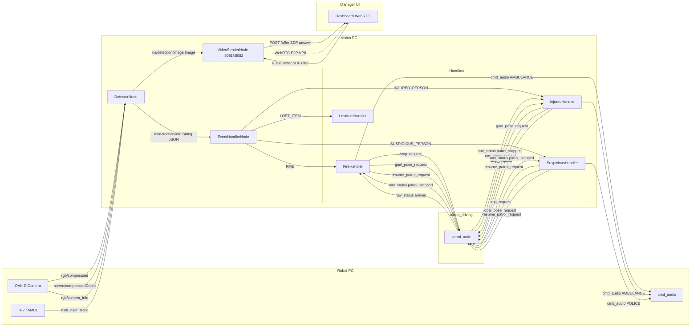

# alfred_vision 아키텍처 문서

> 코드 기반 실측. 추측 항목 없음. 코드와 불일치 시 코드가 우선.

---

## 1. 구성요소별 분석

### DetectorNode (`detector_node.py`)

**목적** OAK-D 카메라에서 RGB+Depth 동기화 → YOLO 추론 → 이벤트 감지 및 발행

**입력**

| 토픽 | 타입 | 비고 |
|---|---|---|
| `{ns}/oakd/rgb/camera_info` | `CameraInfo` | K 행렬 1회 수신 |
| `{ns}/oakd/rgb/image_raw/compressed` | `CompressedImage` | BEST_EFFORT QoS |
| `{ns}/oakd/stereo/image_raw/compressedDepth` | `CompressedImage` | BEST_EFFORT QoS, 12-byte header skip |
| `/tf`, `/tf_static` | TF2 | launch에서 `{ns}/tf`로 remap |

**출력**

| 토픽 | 타입 | 페이로드 |
|---|---|---|
| `{ns}/detection/info` | `String` (JSON) | msg_id, version, event_type, class, robot_id, confidence, location{x,y,floor}, snapshot_ref, timestamp |
| `{ns}/detection/image` | `Image` | bbox 오버레이 BGR8 |

**핵심 제어 흐름**
```
CameraInfo 수신 → K 행렬 저장 (1회)
RGB + Depth ApproximateTimeSynchronizer (slop=0.1s)
    → 3초 throttle (time.monotonic)
    → YOLO 추론 (conf=0.4)
    → bbox별 EVENT_TYPE_MAP 분류
    → depth patch median → 3D 좌표 → TF2 → map 좌표
    → detection/info JSON 발행 (감지된 경우)
    → detection/image 발행 (항상)
    → /tmp/detection_snapshots/ 스냅샷 저장
```

**파라미터**

| 파라미터 | 기본값 |
|---|---|
| `namespace` | `/robot2` |
| `model_path` | `share/alfred_vision/resource/best.pt` |
| `conf` | `0.4` |
| throttle | `3.0s` (하드코딩) |
| `DEPTH_PATCH` | `4` (하드코딩) |

**클래스 → 이벤트 매핑**

| 클래스 | event_type |
|---|---|
| fire | FIRE |
| patient | INJURED_PERSON |
| pistol, knife | SUSPICIOUS_PERSON |
| wallet, bag, phone | LOST_ITEM |

---

### EventHandlerNode (`event_handler_node.py`)

**목적** `detection/info` 수신 → event_type 기반 handler 라우팅

**입력**

| 토픽 | 타입 |
|---|---|
| `{ns}/detection/info` | `String` (JSON) |

**출력** 없음 (handler에 위임)

**핵심 제어 흐름**
```
detection/info 수신 → JSON 파싱
    → event_type 추출 → _handlers[event_type].handle(payload)
    → 알 수 없는 event_type → warn 로그
```

**파라미터**

| 파라미터 | 기본값 | 선택지 |
|---|---|---|
| `namespace` | `/robot2` | `/robot2`, `/robot4` |
| `emergency_exit` | `entrance` | `entrance`, `entrance2`, `gate`, `gate_b` |

---

### FireHandler (`handlers/fire_handler.py`)

**목적** FIRE 이벤트 → 패트롤 정지 → 사이렌 → 비상문 이동 → 패트롤 재개

**입력**

| 소스 | 이름 | 타입 |
|---|---|---|
| EventHandlerNode | `handle(payload)` | dict |
| patrol_node | `{ns}/nav_status` | `String` (`patrol_stopped`, `arrived`) |

**출력**

| 토픽 | 타입 | 시점 |
|---|---|---|
| `{ns}/stop_request` | `Empty` | 감지 즉시 |
| `{ns}/cmd_audio` | `AudioNoteVector` | 감지 즉시 (AMBULANCE 1회) |
| `{ns}/goal_pose_request` | `PoseStamped` | `patrol_stopped` 수신 후 |
| `{ns}/resume_patrol_request` | `Empty` | `arrived` 수신 후 |

**핵심 제어 흐름**
```
handle() → _active=True, _waiting=True
    → stop_request + siren(1회)
nav_status: patrol_stopped → goal_pose_request(비상문 좌표)
nav_status: arrived → resume_patrol_request → _active=False
```

**비상문 좌표 (하드코딩)**

| poi | x | y |
|---|---|---|
| entrance | -8.05 | 2.56 |
| entrance2 | -0.991 | 2.48 |
| gate | -1.8 | 2.0 |
| gate_b | -1.3 | 2.0 |

---

### InjuredHandler (`handlers/injured_handler.py`)

**목적** INJURED_PERSON 이벤트 → 정지 → 연속 사이렌 → 환자 위치 접근 → 30초 대기 → 재개

**입력**

| 소스 | 이름 | 타입 |
|---|---|---|
| EventHandlerNode | `handle(payload)` | dict (location{x,y} 포함) |
| patrol_node | `{ns}/nav_status` | `String` |

**출력**

| 토픽 | 타입 | 시점 |
|---|---|---|
| `{ns}/stop_request` | `Empty` | 감지 즉시 |
| `{ns}/cmd_audio` | `AudioNoteVector` | 감지 즉시 + 2.5s 반복 (AMBULANCE) |
| `{ns}/goal_pose_request` | `PoseStamped` | `patrol_stopped` 수신 후 |
| `{ns}/cmd_audio` | `AudioNoteVector` (silence) | 30초 후 |
| `{ns}/resume_patrol_request` | `Empty` | 30초 후 |

**핵심 제어 흐름**
```
handle() → stop_request + 사이렌 타이머(2.5s) 시작
nav_status: patrol_stopped
    → 위치 있음: goal_pose_request(환자 좌표)
    → 위치 없음: 즉시 30초 타이머
nav_status: arrived → 30초 타이머 시작
30초 후 → silence + resume_patrol_request → _active=False
```

**파라미터** `_SIREN_INTERVAL_SEC=2.5`, `_STAY_SEC=30.0` (하드코딩)

---

### SuspiciousHandler (`handlers/suspicious_handler.py`)

**목적** SUSPICIOUS_PERSON 이벤트 → 정지 → 연속 사이렌 → 타겟 추적 → 소실 시 사이렌 정지 + 재개

**입력**

| 소스 | 이름 | 타입 |
|---|---|---|
| EventHandlerNode | `handle(payload)` | dict (location{x,y}, 3초마다) |
| patrol_node | `{ns}/nav_status` | `String` (`patrol_stopped`) |

**출력**

| 토픽 | 타입 | 시점 |
|---|---|---|
| `{ns}/stop_request` | `Empty` | 첫 감지 시 |
| `{ns}/cmd_audio` | `AudioNoteVector` | 첫 감지 즉시 + 2.5s 반복 (POLICE) |
| `{ns}/goal_pose_request` | `PoseStamped` | patrol_stopped 후, 0.3m 이상 이동 시마다 |
| `{ns}/cmd_audio` | `AudioNoteVector` (silence) | 타겟 소실 시 |
| `{ns}/resume_patrol_request` | `Empty` | 타겟 소실 시 (즉시, nav 없음) |

**핵심 제어 흐름**
```
handle() → _last_seen = now
    첫 감지: stop_request + 사이렌 타이머 + watchdog 타이머
    patrol_stopped 후: goal 업데이트 (0.3m threshold)
watchdog 10초마다 체크:
    last_seen 기준 10초 경과 → silence + resume → 상태 초기화
```

**파라미터** `_NAV_UPDATE_THRESHOLD=0.3m`, `_SIREN_INTERVAL_SEC=2.5s`, `_TARGET_LOST_SEC=10.0s` (하드코딩)

> ⚠️ `nav_status: arrived` 미처리 — 추적 goal 도착 신호 무시. 다음 감지 시 goal 재업데이트.

---

### LostItemHandler (`handlers/lost_item_handler.py`)

**목적** LOST_ITEM 감지 → 로그만

**입력/출력/흐름** 없음. 로그 1줄 출력.

---

### VideoSenderNode (`video_sender_node.py`)

**목적** `{ns}/detection/image` → WebRTC VP8 스트림 서빙 (브라우저 recvonly)

**입력**

| 소스 | 이름 | 타입 |
|---|---|---|
| DetectorNode | `{ns}/detection/image` | `Image` |
| Browser | `POST /offer` | JSON `{sdp, type:"offer"}` |

**출력**

| 대상 | 이름 | 타입 |
|---|---|---|
| Browser | `POST /offer` 응답 | JSON `{sdp, type:"answer"}` |
| Browser | `GET /health` 응답 | JSON `{status, peers}` |
| Browser | WebRTC P2P | VP8 sendonly, 30fps |

**핵심 제어 흐름**
```
Image 수신 → _RosVideoTrack.push(bgr) (thread-safe)
POST /offer:
    → setRemoteDescription(offer)
    → addTrack(_RosVideoTrack)
    → createAnswer → setLocalDescription
    → ICE 수집 완료 대기 (non-trickle, timeout=10s)
    → answer SDP 반환 (CORS 헤더 포함)
connectionState failed/closed → PeerConnection 정리
```

**파라미터**

| 파라미터 | 기본값 |
|---|---|
| `namespace` | `/robot2` |
| `signal_port` | `8081` |

**수신측 설정** `fms_server/web/video_sources.json`의 `signal_url`에 `http://<로봇IP>:8081/offer` 기입

---

## 2. 모듈 간 인터페이스 불일치

| 송신측 | 수신측 | 토픽/엔드포인트 | 타입 | 상태 |
|---|---|---|---|---|
| DetectorNode | EventHandlerNode | `{ns}/detection/info` | String JSON | ✅ |
| DetectorNode | VideoSenderNode | `{ns}/detection/image` | Image | ✅ |
| FireHandler | patrol_node | `{ns}/stop_request` | Empty | ✅ |
| FireHandler | patrol_node | `{ns}/goal_pose_request` | PoseStamped | ✅ |
| FireHandler | patrol_node | `{ns}/resume_patrol_request` | Empty | ✅ |
| InjuredHandler | patrol_node | `{ns}/stop_request` | Empty | ✅ |
| InjuredHandler | patrol_node | `{ns}/goal_pose_request` | PoseStamped | ✅ |
| InjuredHandler | patrol_node | `{ns}/resume_patrol_request` | Empty | ✅ |
| SuspiciousHandler | patrol_node | `{ns}/stop_request` | Empty | ✅ |
| SuspiciousHandler | patrol_node | `{ns}/goal_pose_request` | PoseStamped | ✅ |
| SuspiciousHandler | patrol_node | `{ns}/resume_patrol_request` | Empty | ✅ |
| patrol_node | Fire/Injured/SuspiciousHandler | `{ns}/nav_status` | String | ✅ |
| VideoSenderNode | Browser | WebRTC VP8 | P2P | ✅ (signal URL 수신측 설정 필요) |
| **SuspiciousHandler** | **(없음)** | `{ns}/nav_status: arrived` | — | ⚠️ 미처리 (의도적) |

---

## 3. 연결 다이어그램


