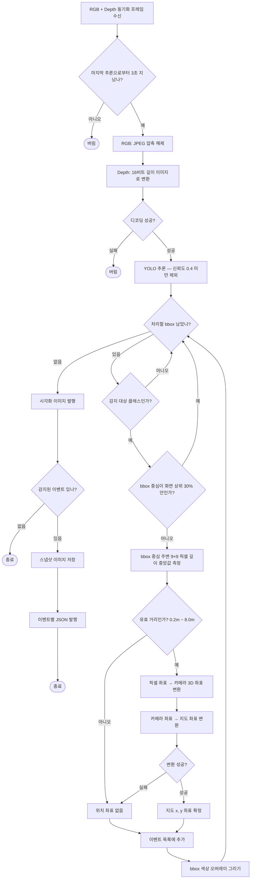
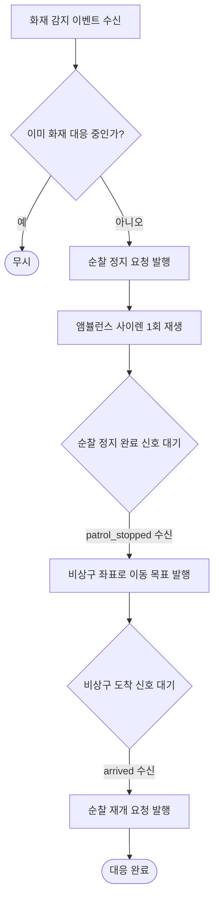
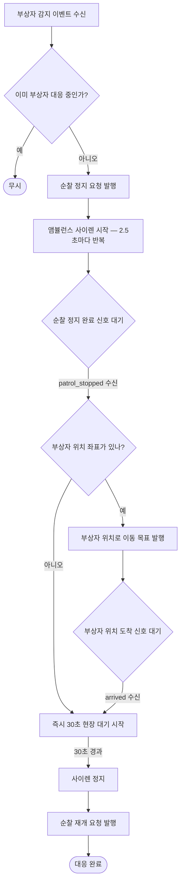
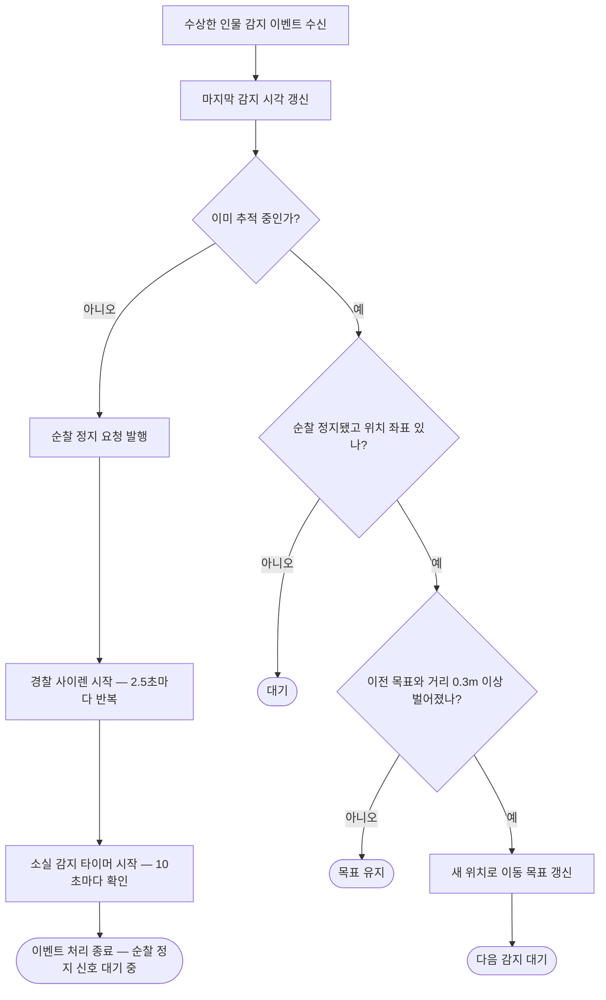
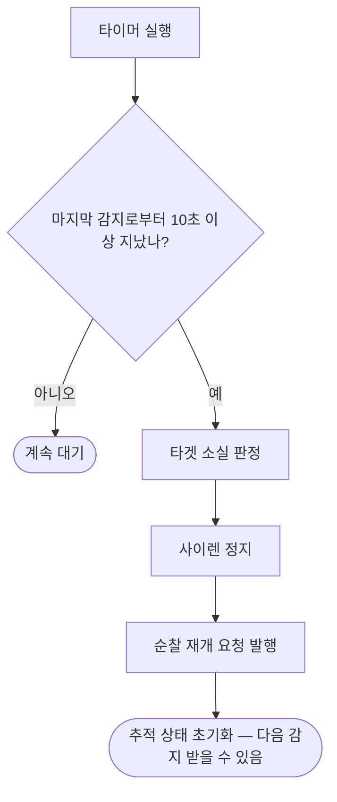
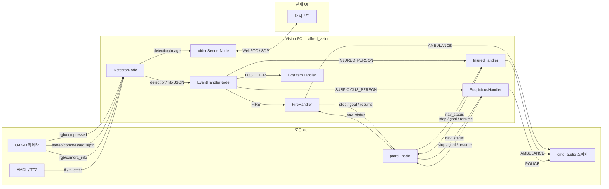

# alfred_vision 패키지 코드 리뷰

> 작성 기준: 실제 코드 100% 반영. 추측 없음.

---

## 1. 패키지 개요

alfred_vision은 순찰 로봇(robot2, robot4)의 카메라 데이터를 수신해서
YOLO로 이벤트를 감지하고, 감지 결과에 따라 로봇 행동을 트리거하고,
관제 UI에 영상을 스트리밍하는 패키지다.

**구성 노드:**

| 노드 | 역할 |
|------|------|
| `DetectorNode` | RGB+Depth 입력 → YOLO 추론 → 이벤트 JSON 발행 |
| `EventHandlerNode` | 이벤트 JSON 수신 → event_type별 핸들러 호출 |

---

## 2. 파일 구조와 그 이유

```
alfred_vision/
├── detector_node.py          ← 카메라 → YOLO 추론 → 이벤트 발행
├── event_handler_node.py     ← 이벤트 수신 → 핸들러 라우팅
├── audio.py                  ← 사운드 패턴 공유 상수
└── handlers/
    ├── fire_handler.py       ← FIRE 이벤트 처리
    ├── injured_handler.py    ← INJURED_PERSON 이벤트 처리
    ├── suspicious_handler.py ← SUSPICIOUS_PERSON 이벤트 처리
    └── lost_item_handler.py  ← LOST_ITEM 이벤트 처리
```

**구조를 이렇게 나눈 이유:**

- **노드 파일 분리**: 세 노드는 독립 실행 가능하고 역할이 완전히 다르다. `detector`는 영상처리 집중, `event_handler`는 로봇 제어 집중, `video_sender`는 네트워크 스트리밍 집중. 하나의 파일에 몰면 책임이 섞이고 테스트/수정이 어려워진다.

- **handlers/ 서브디렉토리**: 이벤트 타입이 4종류이고 각자 행동 로직이 다르다. 하나의 파일에 쓰면 300줄 이상의 거대한 if-else가 된다. 타입별 파일로 분리하면 화재 로직만 수정할 때 다른 로직에 영향이 없다.

- **audio.py 분리**: AMBULANCE, POLICE 사운드 패턴은 `InjuredHandler`, `FireHandler`, `SuspiciousHandler` 3곳에서 공유한다. 각 파일에 하드코딩하면 동기화 실패 위험이 있어서 공유 상수 파일로 뺐다.

- **video_sender_node.py**: 별도 팀 담당 (이 리뷰 범위 외)

---

## 3. Input — 무엇을 받고, 왜 그것인가

### 3-1. RGB 이미지: `compressedImage` (JPEG)

```
구독 토픽: {ns}/oakd/rgb/image_raw/compressed
타입:      sensor_msgs/CompressedImage
```

**왜 raw가 아닌 compressed인가?**

OAK-D 카메라는 WiFi로 연결되어 있다. 실측 결과:

| 토픽 | Hz | 메시지 크기 | 대역폭 |
|------|-----|------------|--------|
| `image_raw` (raw bgr8) | ~4 fps | 1.49 MB | ~5 MB/s |
| `image_raw/compressed` (JPEG) | **~10 fps** | ~29 KB | ~300 KB/s |

- raw는 WiFi 한계(~5 MB/s)로 4fps에서 포화. 10fps 달성 불가.
- compressed는 51배 압축으로 10fps 안정 수신.
- YOLO는 JPEG 손실압축 후에도 감지 정확도 유지됨.

**수신 시 처리:**
```python
buf   = np.frombuffer(rgb_msg.data, dtype=np.uint8)  # bytes → numpy
frame = cv2.imdecode(buf, cv2.IMREAD_COLOR)           # JPEG 디코딩 → BGR
```
`cv_bridge`가 아닌 `cv2.imdecode`를 쓰는 이유: CompressedImage는 cv_bridge로 직접 변환 시 내부에서 동일 작업을 하며 불필요한 오버헤드가 생긴다.

---

### 3-2. Depth 이미지: `compressedDepth` (PNG 16bit)

```
구독 토픽: {ns}/oakd/stereo/image_raw/compressedDepth
타입:      sensor_msgs/CompressedImage
```

**왜 raw depth가 아닌 compressedDepth인가?**

| 토픽 | Hz | 메시지 크기 | 대역폭 |
|------|-----|------------|--------|
| `stereo/image_raw` (raw 16UC1) | ~6 fps | 0.99 MB | ~6.9 MB/s |
| `stereo/image_raw/compressedDepth` | ~14-15 fps | **0.06 MB** | ~1.5 MB/s |

- raw depth는 7MB/s로 WiFi 포화.
- compressedDepth는 PNG 무손실 압축으로 16.5배 압축 + 4.6배 대역폭 절감.
- Depth는 거리값(mm 정수)이므로 무손실 압축이 필수. JPEG 같은 손실압축 불가.

**compressedDepth 포맷 특이사항:**

`sensor_msgs/CompressedImage`인데 일반 compressed와 다르다.
앞 12바이트는 `ConfigHeader`(내부 메타데이터)이고 실제 PNG 데이터가 그 뒤에 온다.

```python
depth_arr = np.frombuffer(bytes(depth_msg.data)[12:], dtype=np.uint8)  # 12바이트 헤더 제거
depth = cv2.imdecode(depth_arr, cv2.IMREAD_ANYDEPTH)                   # 16bit PNG 디코딩
```

`IMREAD_ANYDEPTH` 플래그가 중요하다. 이 플래그 없이 읽으면 8bit로 잘려서 거리 정보가 소실된다. 이 플래그로 읽으면 16bit 그대로 유지되며 각 픽셀값 = 거리(mm).

---

### 3-3. 카메라 내부 파라미터: `CameraInfo`

```
구독 토픽: {ns}/oakd/rgb/camera_info
타입:      sensor_msgs/CameraInfo
```

K 행렬(카메라 내부 파라미터)을 한 번만 수신하면 된다.

```
K = [fx  0  cx]
    [0  fy  cy]
    [0   0   1]
```

- `fx`, `fy`: 초점 거리 (픽셀 단위). bbox 중심 픽셀 위치를 3D 카메라 좌표로 역투영할 때 사용.
- `cx`, `cy`: 이미지 주점 (보통 이미지 중심).

수신 후 저장하고 구독을 유지하지 않아도 되지만, 코드에서는 `_K is None` 체크로 최초 1회만 실제 처리한다.

---

### 3-4. TF2 (좌표계 변환 트리)

```
소스: /tf, /tf_static
launch에서 remap: /tf → /{ns}/tf, /tf_static → /{ns}/tf_static
```

robot2와 robot4 각자의 TF 트리가 필요하다. 두 로봇이 같은 PC에서 동작할 때 `/tf`를 공유하면 로봇간 좌표계가 섞인다. launch에서 네임스페이스별로 리맵해서 격리한다.

TF 트리 구조:
```
{ns}/oakd_right → {ns}/base_link → {ns}/odom → map
```

AMCL이 `odom → map` 변환을 제공한다. AMCL initial pose 설정 전에는 `map` 프레임이 없어서 TF 변환이 실패한다 (3초 쓰로틀로 warn 출력).

---

## 4. 플로우차트

### 4-1. DetectorNode 처리 흐름



---

### 4-2. FireHandler 흐름



---

### 4-3. InjuredHandler 흐름



---

### 4-4. SuspiciousHandler 흐름

**감지 이벤트 처리 흐름** — `handle()` 호출 시마다 실행



> patrol_stopped 수신 시 추적 활성화 — 이후 감지 이벤트에서 위 흐름의 `이미 추적 중` 경로로 진입

**소실 감지 타이머** — 10초마다 독립 실행



---

## 5. detector_node.py — 라인별 설명


### 5-1. 전역 상수

```python
DEFAULT_MODEL = os.path.join(
    os.path.dirname(__file__), '..', '..', '..', '..', 'share',
    'alfred_vision', 'resource', 'best.pt'
)
```
설치된 패키지의 share 디렉토리 경로를 런타임에 계산한다. 하드코딩 금지.

```python
CONF_THRESH  = 0.4    # YOLO 감지 신뢰도 임계값. 이하는 무시.
SNAPSHOT_DIR = Path('/tmp/detection_snapshots')  # 이벤트 발생 시 이미지 저장 경로
DEPTH_PATCH  = 4      # depth 추출 시 bbox 중심 주변 ±4 픽셀 패치 크기 (9x9 영역)
```

```python
ROBOT_ID_MAP = { '/robot2': 'robot2', '/robot4': 'robot4' }
# namespace 문자열 → JSON payload의 robot_id 변환 테이블
FLOOR_MAP    = { '/robot2': 1, '/robot4': 2 }
# namespace → 층 번호 (인터페이스 정의서 IF-05 기준)
EVENT_TYPE_MAP = {
    'fire':    'FIRE',
    'patient': 'INJURED_PERSON',
    'pistol':  'SUSPICIOUS_PERSON',
    'knife':   'SUSPICIOUS_PERSON',   # pistol, knife 모두 SUSPICIOUS_PERSON으로 통합
    'wallet':  'LOST_ITEM',
    'bag':     'LOST_ITEM',
    'phone':   'LOST_ITEM',           # wallet, bag, phone 모두 LOST_ITEM으로 통합
}
EVENT_COLOR = {
    'FIRE':              (0,   60,  255),   # BGR: 빨강
    'INJURED_PERSON':    (0,   165, 255),   # BGR: 주황
    'SUSPICIOUS_PERSON': (0,   255, 255),   # BGR: 노랑
    'LOST_ITEM':         (255, 200,   0),   # BGR: 파랑
}
```

---

### 5-2. `__init__` — 초기화

```python
super().__init__('detector')

self.declare_parameter('model_path', DEFAULT_MODEL)
self.declare_parameter('conf',       CONF_THRESH)
self.declare_parameter('namespace',  '/robot2')
# ROS2 파라미터로 선언. 외부에서 --ros-args -p namespace:=/robot4 로 오버라이드 가능.

model_path = self.get_parameter('model_path').value
self.conf  = self.get_parameter('conf').value
self.ns    = self.get_parameter('namespace').value.strip()
# .strip()은 파라미터 파일의 공백 실수 방어

SNAPSHOT_DIR.mkdir(parents=True, exist_ok=True)
# /tmp/detection_snapshots 없으면 생성

from ultralytics import YOLO
self.model  = YOLO(model_path)   # YOLO 모델 로드 (첫 호출 시 torch 초기화로 수초 소요)
self.bridge = CvBridge()         # ROS Image ↔ numpy 변환기 (detector는 Image 발행에 사용)
```

```python
self.tf_buffer   = Buffer()
self.tf_listener = TransformListener(self.tf_buffer, self)
# tf_buffer: TF 변환 캐시. tf_listener: /tf 구독하며 버퍼 채움.
# 두 객체 모두 유지해야 TF가 계속 업데이트됨.

qos_be = QoSProfile(depth=10, reliability=ReliabilityPolicy.BEST_EFFORT)
# BEST_EFFORT QoS: 패킷 손실 허용. OAK-D 카메라가 BEST_EFFORT로 발행하므로 일치시켜야 연결됨.
# RELIABLE로 설정하면 QoS 불일치로 구독 실패.
```

```python
self._lock            = threading.Lock()
# _depth, _K, _camera_frame은 ROS 콜백(스핀 스레드)과 _process에서 접근 — lock 필수
self._K               = None    # CameraInfo K 행렬 (처음 수신 시 설정, 이후 불변)
self._depth           = None    # 최신 depth 이미지 (콜백마다 교체)
self._camera_frame    = None    # depth 이미지의 frame_id (TF 변환 출발점)
self._first_frame     = True    # 첫 프레임 수신 로그용 플래그
self._last_infer_time = 0.0     # 마지막 YOLO 추론 시각 (3초 쓰로틀 제어)
```

```python
self.create_subscription(CameraInfo, f'{self.ns}/oakd/rgb/camera_info',
                         self._cb_camera_info, 1)
# depth=1: CameraInfo는 자주 올 필요 없음. 최신 1개만 유지.

rgb_sub   = Subscriber(self, CompressedImage,
                       f'{self.ns}/oakd/rgb/image_raw/compressed', qos_profile=qos_be)
depth_sub = Subscriber(self, CompressedImage,
                       f'{self.ns}/oakd/stereo/image_raw/compressedDepth', qos_profile=qos_be)
# message_filters.Subscriber: ApproximateTimeSynchronizer에 등록하기 위한 래퍼

ts = ApproximateTimeSynchronizer([rgb_sub, depth_sub], queue_size=10, slop=0.1)
ts.registerCallback(self._cb_synced)
# RGB와 Depth를 시간 기준으로 동기화. slop=0.1s: 두 메시지 timestamp 차이가 0.1초 이내일 때 매칭.
# RGB ~10fps, compressedDepth ~14fps — 주기 다름. 시간 동기화 없이 쓰면 불일치 좌표 계산.

self._pub_event = self.create_publisher(String, f'{self.ns}/detection/info',  10)
self._pub_img   = self.create_publisher(Image,  f'{self.ns}/detection/image', 10)
```

`main()`에서 `MultiThreadedExecutor`를 쓰는 이유: `_to_map()`의 `tf_buffer.transform(..., timeout=Duration(seconds=0.5))`은 블로킹 호출이다. `SingleThreadedExecutor`라면 TF 대기 0.5초 동안 `_cb_camera_info`, `_cb_synced` 등 다른 콜백이 전부 멈춘다. `MultiThreadedExecutor`는 콜백을 별도 스레드에서 실행하므로 TF 대기 중에도 다른 콜백이 처리된다.

---

### 5-3. `_cb_camera_info` — K 행렬 수신

```python
def _cb_camera_info(self, msg: CameraInfo):
    with self._lock:
        if self._K is None:                          # 아직 K 행렬 없으면
            self._K = np.array(msg.k).reshape(3, 3)  # msg.k: 9개 float 리스트 → 3x3 행렬
            self.get_logger().info(...)               # 수신 확인 로그
```

`_K is None` 체크: 한 번 받으면 카메라 파라미터는 바뀌지 않는다. 매 콜백마다 덮어쓰지 않아도 된다. lock이 필요한 이유는 `_process()`에서 `_K`를 읽기 때문이다.

---

### 5-4. `_cb_synced` — RGB+Depth 동기화 콜백

```python
def _cb_synced(self, rgb_msg: CompressedImage, depth_msg: CompressedImage):
    import time
    now = time.monotonic()
    if now - self._last_infer_time < 3.0:
        return                          # 마지막 추론으로부터 3초 미경과 시 무시
    self._last_infer_time = now
```

**3초 쓰로틀 이유:** YOLO 추론은 CPU/GPU 집약적이다. 10fps로 매 프레임 추론하면 처리 지연이 쌓여 콜백 큐가 밀린다. 순찰 감지는 3초에 1번으로도 충분하다. 이벤트 중복 발행도 방지된다.

**왜 ROS 타이머 대신 콜백 내부 throttle인가?**
ROS 타이머로 구현하려면 "최신 프레임을 멤버 변수에 저장 → 타이머에서 꺼내서 추론" 구조가 필요하다. 이 방식은 프레임 저장용 lock, 타이머 콜백, 상태 관리가 추가된다. 콜백 내부 throttle은 "동기화된 프레임이 왔을 때, 시간이 충분히 지났으면 추론"으로 단순하게 해결한다.

```python
    buf   = np.frombuffer(rgb_msg.data, dtype=np.uint8)
    # CompressedImage.data는 bytes 배열 → numpy uint8 배열로 변환 (메모리 복사 없이 뷰 생성)
    frame = cv2.imdecode(buf, cv2.IMREAD_COLOR)
    # JPEG 바이트 → BGR numpy 배열 (HxWx3, uint8)

    depth_arr = np.frombuffer(bytes(depth_msg.data)[12:], dtype=np.uint8)
    # compressedDepth: 앞 12바이트는 ROS image_transport의 ConfigHeader → 슬라이싱으로 제거
    # bytes() 변환 후 슬라이싱: memoryview는 직접 슬라이싱 안 되는 경우 대비
    depth = cv2.imdecode(depth_arr, cv2.IMREAD_ANYDEPTH)
    # ANYDEPTH: 16bit 그대로 읽음. 각 픽셀값 = 거리(mm, uint16)

    if frame is None or depth is None:
        return                          # 디코딩 실패 (손상된 패킷) — 조용히 스킵

    if self._first_frame:
        self._first_frame = False
        self.get_logger().info(...)     # 시스템 정상 동작 확인용 로그 (최초 1회)

    with self._lock:
        self._depth        = depth
        self._camera_frame = depth_msg.header.frame_id   # depth의 좌표계 이름 저장
    # depth_msg.header.frame_id 예: "robot4/oakd_right"
    # 이 frame_id를 TF 변환의 출발점으로 사용하므로 depth와 함께 저장

    self._process(frame, rgb_msg.header)
    # frame과 rgb header를 넘김. header의 stamp는 발행 이미지의 timestamp에 사용.

except Exception as e:
    self.get_logger().error(f'... {e}')
    # 콜백에서 예외가 나면 ROS 스핀이 멈추지 않도록 catch
```

---

### 5-5. `_depth_at` — Depth 값 추출 (노이즈 제거)

```python
def _depth_at(self, depth: np.ndarray, u: int, v: int) -> float:
    h, w = depth.shape[:2]
    v0, v1 = max(0, v - DEPTH_PATCH), min(h, v + DEPTH_PATCH + 1)
    u0, u1 = max(0, u - DEPTH_PATCH), min(w, u + DEPTH_PATCH + 1)
    # (u, v) 중심으로 ±4픽셀 패치 범위 계산. max/min으로 이미지 경계 밖 인덱스 방지.

    patch = depth[v0:v1, u0:u1].astype(np.float32)
    # 9x9 (최대) 패치 추출 + float32로 변환 (median 계산 정밀도)

    valid = patch[patch > 0]
    # depth=0 픽셀 제외. OAK-D stereo는 측정 실패 픽셀을 0으로 채움 (글레어, 반사면 등)

    if valid.size == 0:
        return 0.0              # 유효한 depth 없음 → 0 반환 → 호출부에서 좌표 계산 스킵

    return float(np.median(valid)) / 1000.0
    # 중앙값: 단일 픽셀 depth는 노이즈 큼. 패치 중앙값으로 안정화.
    # / 1000.0: mm → m 변환 (TF 좌표계는 m 단위)
```

**왜 단일 픽셀이 아닌 패치 중앙값인가?**

stereo depth는 텍스처 없는 단색 면, 물체 엣지, 반사면에서 노이즈가 크다. 단일 픽셀 값은 몇 배씩 튀기도 한다. 주변 9x9 패치의 중앙값은 이상치에 강인하다 (mean보다 median이 이상치 영향 덜 받음).

---

### 5-6. `_to_map` — 카메라 좌표 → map 좌표

```python
def _to_map(self, X: float, Y: float, Z: float, frame_id: str):
    pt = PointStamped()
    pt.header.stamp    = Time().to_msg()      # stamp=0: "가장 최신 TF 사용"을 의미
    pt.header.frame_id = frame_id             # 출발 좌표계: depth 이미지의 frame_id
    pt.point.x = X                            # 카메라 좌표계에서의 3D 위치
    pt.point.y = Y
    pt.point.z = Z
    pt_map = self.tf_buffer.transform(pt, 'map', timeout=Duration(seconds=0.5))
    # TF2로 frame_id → map 좌표계 변환. timeout=0.5s: TF 버퍼에 없으면 최대 0.5초 대기.
    return pt_map.point.x, pt_map.point.y
    # map 좌표계에서의 2D 위치 (x, y). z는 바닥면이므로 무시.
```

**호출부에서 역투영 수식:**
```python
# 핀홀 카메라 모델 역투영: 픽셀 (cu, cv) + 깊이 z → 카메라 3D 좌표 (X, Y, Z)
X = (cu - cx) * z / fx   # cu: bbox 중심 u, cx: 주점 x, fx: 초점거리 x
Y = (cv_ - cy) * z / fy  # cv_: bbox 중심 v (cv 변수명 충돌 방지로 언더스코어)
# Z = z (그대로 사용)
```

---

### 5-7. `_process` — YOLO 추론 및 이벤트 생성

```python
def _process(self, frame: np.ndarray, header):
    results = self.model(frame, conf=self.conf, verbose=False)
    # YOLO 추론. conf: 신뢰도 임계값(0.4). verbose=False: 추론 로그 출력 억제.

    events = []
    vis    = frame.copy()
    # vis: 시각화용 이미지. 원본 frame을 건드리지 않기 위해 copy.

    with self._lock:
        K            = self._K
        depth        = self._depth.copy() if self._depth is not None else None
        camera_frame = self._camera_frame
    # lock 구간을 최소화: 데이터 복사 후 lock 해제, 이후 복사본으로 작업.
    # depth.copy()가 중요: lock 밖에서 수정되면 race condition 발생 가능.
```

**왜 lock을 copy 직후에 해제하는가?**
YOLO 추론은 CPU 집약적으로 수십~수백ms 걸린다. lock을 추론 전체 동안 잡고 있으면 `_cb_synced` 콜백이 그동안 새 depth를 못 쓴다. lock은 공유 데이터 접근 최소 구간에만 잡고, 이후 처리는 복사본으로 한다.

```python
```

```python
    for r in results:
        for box in r.boxes:
            x1, y1, x2, y2 = [int(v) for v in box.xyxy[0].tolist()]
            # xyxy: 좌상단(x1,y1), 우하단(x2,y2) bbox 좌표 (픽셀)
            conf       = float(box.conf[0])              # 감지 신뢰도 (0.0~1.0)
            cls_name   = self.model.names[int(box.cls[0])]  # 클래스 이름 (예: 'fire')
            event_type = EVENT_TYPE_MAP.get(cls_name)
            if event_type is None:
                continue                 # 매핑 없는 클래스 무시 (모델에 다른 클래스 있을 수 있음)

            cu, cv_ = (x1 + x2) // 2, (y1 + y2) // 2
            # bbox 중심 픽셀 좌표. depth 추출의 기준점.
```

```python
            obj_x, obj_y = None, None
            if K is not None and depth is not None and camera_frame:
                # K, depth, camera_frame 세 가지 모두 있을 때만 좌표 계산 시도
                z = self._depth_at(depth, cu, cv_)
                if 0.2 < z < 8.0:
                    # 유효 거리 범위: 0.2m(너무 가까운 노이즈) ~ 8.0m(OAK-D stereo 유효 범위)
                    fx, fy = K[0, 0], K[1, 1]
                    cx, cy = K[0, 2], K[1, 2]
                    X = (cu - cx) * z / fx          # 핀홀 역투영
                    Y = (cv_ - cy) * z / fy
                    try:
                        obj_x, obj_y = self._to_map(X, Y, z, camera_frame)
                    except Exception as e:
                        self.get_logger().warn(..., throttle_duration_sec=5.0)
                        # throttle_duration_sec: 5초에 1번만 warn 출력. TF 실패가 잦을 때 로그 폭주 방지.
                        # obj_x, obj_y는 None 유지 → 좌표 없이 이벤트 발행
```

```python
            events.append({
                'event_type': event_type,
                'class':      cls_name,      # 세부 클래스 (예: 'pistol' — SUSPICIOUS와 다를 수 있음)
                'confidence': round(conf, 3),
                'obj_x':      round(obj_x, 3) if obj_x is not None else None,
                'obj_y':      round(obj_y, 3) if obj_y is not None else None,
            })
            # round(, 3): JSON 크기 줄이기 + 불필요한 소수점 제거

            # 시각화: bbox + 라벨 오버레이
            col = EVENT_COLOR[event_type]
            cv2.rectangle(vis, (x1, y1), (x2, y2), col, 2)
            label = f'{cls_name} {conf:.2f}'
            (tw, th), _ = cv2.getTextSize(label, cv2.FONT_HERSHEY_SIMPLEX, 0.6, 2)
            cv2.rectangle(vis, (x1, y1 - th - 6), (x1 + tw + 4, y1), col, -1)
            # 라벨 배경 사각형: 텍스트 가독성 위해 bbox 색으로 채움
            cv2.putText(vis, label, (x1 + 2, y1 - 4),
                        cv2.FONT_HERSHEY_SIMPLEX, 0.6, (255, 255, 255), 2)
            # 흰색 텍스트: 어떤 배경색에도 대비 확보
```

```python
    img_msg = self.bridge.cv2_to_imgmsg(vis, encoding='bgr8')
    img_msg.header = header
    self._pub_img.publish(img_msg)
    # 시각화 이미지는 항상 발행. 감지 없어도 원본 이미지를 VideoSenderNode에 제공.
    # header(timestamp 포함) 유지: 수신측에서 메시지 시각 알 수 있음.

    if not events:
        return          # 감지된 이벤트 없으면 JSON 발행 없이 종료

    ts       = datetime.now(timezone.utc)
    robot_id = ROBOT_ID_MAP.get(self.ns, self.ns.lstrip('/'))
    # get 실패 시 네임스페이스 앞 슬래시 제거해서 폴백 (알 수 없는 로봇도 동작)
    floor    = FLOOR_MAP.get(self.ns, 1)

    snapshot_name = f'img_{robot_id}_{ts.strftime("%Y%m%d_%H%M%S_%f")}.jpg'
    cv2.imwrite(str(SNAPSHOT_DIR / snapshot_name), vis)
    # 이벤트 발생 시만 스냅샷 저장. 항상 저장하면 /tmp 디스크 금방 참.
    # vis (bbox 오버레이 이미지) 저장: 감지 당시 장면 증거로 활용.

**왜 같은 프레임에서 여러 이벤트가 나와도 snapshot이 1개인가?**
같은 프레임에서 감지된 이벤트들(예: 화재 + 부상자 동시 감지)은 동일한 순간의 장면이다. 각 이벤트 JSON의 `snapshot_ref`가 같은 파일을 가리켜도 의미상 맞다. 이벤트마다 별도 저장하면 중복 파일만 늘어난다.
```

```python
    for ev in events:
        payload = {
            'msg_id':       str(uuid.uuid4()),   # 이벤트 고유 ID (중복 처리 방지)
            'version':      '2.0',               # IF-05 인터페이스 버전
            'event_type':   ev['event_type'],
            'class':        ev['class'],
            'robot_id':     robot_id,
            'confidence':   ev['confidence'],
            'location':     {
                'x':     ev['obj_x'],
                'y':     ev['obj_y'],
                'floor': floor,
            },
            'snapshot_ref': snapshot_name,       # 저장된 이미지 파일명 (경로 아님)
            'timestamp':    ts.isoformat(),      # ISO 8601 UTC (예: 2026-06-09T12:34:56+00:00)
        }
        msg = String()
        msg.data = json.dumps(payload, ensure_ascii=False)
        # ensure_ascii=False: 한국어 등 유니코드 문자 깨짐 방지
        self._pub_event.publish(msg)

    self.get_logger().info(f'[{self.ns}] IF-05 발행: {[ev["class"] for ev in events]}')
```

**왜 `msg_id`에 uuid4를 쓰는가?**
DetectorNode는 3초마다 같은 장면에서 같은 이벤트를 반복 발행할 수 있다. FMS 서버나 EventHandlerNode가 수신측에서 "이전에 처리한 이벤트인가?"를 판별하려면 각 메시지가 고유 식별자를 가져야 한다. UUID 없으면 수신측은 중복 여부를 알 수 없다.

```python
```

---

## 6. event_handler_node.py — 라인별 설명

```python
class EventHandlerNode(Node):
    def __init__(self):
        super().__init__('event_handler')

        ns       = self.get_parameter('namespace').value.strip()
        exit_poi = self.get_parameter('emergency_exit').value
        # emergency_exit: 비상출구 위치 이름 (entrance | entrance2 | gate | gate_b)
        # 파라미터로 분리한 이유: 같은 코드를 robot2/robot4에서 다른 비상구로 사용 가능.

        self._handlers = {
            'FIRE':              FireHandler(self, ns, exit_poi),
            'INJURED_PERSON':    InjuredHandler(self, ns),
            'SUSPICIOUS_PERSON': SuspiciousHandler(self, ns),
            'LOST_ITEM':         LostItemHandler(self, ns),
        }
        # dict 룩업: if-elif 체인보다 빠르고, 새 이벤트 타입 추가 시 dict에만 추가하면 됨.
        # 생성자에서 모든 핸들러 인스턴스화: 각 핸들러가 publisher/subscriber를 등록하므로
        # 노드 초기화 시점에 모두 준비되어야 함.

        self.create_subscription(String, f'{ns}/detection/info', self._cb_event, 10)

    def _cb_event(self, msg: String):
        try:
            payload = json.loads(msg.data)   # JSON 파싱
        except json.JSONDecodeError as e:
            self.get_logger().error(...)     # 파싱 실패: 잘못된 발행자 방어
            return

        event_type = payload.get('event_type')  # dict.get: 키 없어도 None 반환 (예외 없음)
        handler = self._handlers.get(event_type)
        if handler:
            handler.handle(payload)             # 해당 핸들러에 payload 전달
        else:
            self.get_logger().warn(...)         # 알 수 없는 event_type 경고 로그
```

---

## 7. handlers/ 상세 설명

### 7-1. audio.py

```python
SOUND_AMBULANCE = [
    (880, 0, 300_000_000),   # (주파수 Hz, 초, 나노초) — 880Hz 0.3초
    (440, 0, 300_000_000),   # 440Hz 0.3초
    ...                       # 교대 반복 → 앰뷸런스 사이렌 패턴
]
SOUND_POLICE = [
    (660, 0, 500_000_000),   # 660Hz 0.5초
    (880, 0, 500_000_000),   # 880Hz 0.5초
    ...                       # 경찰 사이렌 패턴
]

def make_audio_msg(pattern):
    msg = AudioNoteVector()
    msg.append = False       # 기존 재생 중인 사운드 중단하고 새로 재생
    for freq, sec, nsec in pattern:
        note = AudioNote()
        note.frequency    = freq
        note.max_runtime  = Duration(sec=sec, nanosec=nsec)
        msg.notes.append(note)
    return msg

def make_silence_msg():
    msg = AudioNoteVector()
    msg.append = False
    # notes 비어있음 → 재생 중지
    return msg
```

---

### 7-2. fire_handler.py — 화재 대응

**흐름:**
```
감지 → stop_request + 사이렌(1회) → patrol_stopped 대기 → 비상문 goal → arrived 대기 → resume
```

```python
def handle(self, payload: dict):
    if self._active:
        return          # 이미 처리 중이면 중복 트리거 무시. 3초마다 이벤트가 올 수 있음.
    self._active = True

    self._waiting = True
    self._pub_stop.publish(Empty())    # patrol_node에 정지 요청
    self._pub_audio.publish(make_audio_msg(SOUND_AMBULANCE))  # 앰뷸런스 사이렌 1회

**왜 `_active`와 `_waiting` 두 플래그를 분리하는가?**
`_active`는 "화재 대응 전체가 진행 중"을 뜻한다. 새 화재 감지가 와도 중복 대응을 막는다.
`_waiting`은 더 좁은 의미로 "patrol이 멈추길 기다리는 중"이다. `patrol_stopped`가 오면 `_waiting=False`로 바꾸고 goal을 보낸다. 이후 `arrived`를 기다리는 단계에서는 `_active=True, _waiting=False` 상태다. 두 플래그가 없으면 `_cb_nav_status`에서 지금이 "정지 대기 단계"인지 "이동 완료 대기 단계"인지 구분할 수 없다.

**왜 `handle()`에서 바로 goal을 보내지 않는가?**
`handle()` 호출 시점에 로봇은 아직 순찰 중이다. nav2에 goal을 즉시 보내면 현재 진행 중인 순찰 경로와 충돌한다. `patrol_stopped`로 로봇이 완전히 정지했음을 확인한 뒤에야 새 goal을 안전하게 전달할 수 있다.

def _cb_nav_status(self, msg: String):
    if self._waiting and msg.data.startswith('patrol_stopped'):
        # startswith: 'patrol_stopped:waypoint_3' 같은 추가 정보가 붙을 수 있어서
        self._waiting = False
        goal = PoseStamped()
        goal.header.frame_id    = 'map'
        goal.header.stamp       = self._node.get_clock().now().to_msg()
        goal.pose.position.x    = self._door_x    # 비상문 좌표 (하드코딩)
        goal.pose.position.y    = self._door_y
        goal.pose.orientation.w = 1.0             # orientation.w=1.0: 회전 없음
        self._pub_goal.publish(goal)

    elif self._active and msg.data == 'arrived':
        self._pub_resume.publish(Empty())    # 비상문 도착 → 순찰 재개
        self._active = False                 # 상태 초기화
```

**비상문 좌표 (하드코딩):**

| POI | x | y | 로봇 |
|-----|---|---|------|
| entrance | -8.05 | 2.56 | robot2 전용 |
| entrance2 | -0.991 | 2.48 | robot2 전용 |
| gate | -1.8 | 2.0 | robot4 전용 |
| gate_b | -1.3 | 2.0 | robot4 전용 |

---

### 7-3. injured_handler.py — 부상자 대응

**흐름:**
```
감지 → stop_request + 사이렌(2.5s 반복) → patrol_stopped →
    위치 있음: 환자 좌표 goal → arrived → 30초 대기 → 사이렌 종료 + resume
    위치 없음: 즉시 30초 대기 → 사이렌 종료 + resume
```

```python
self._siren_timer = self._node.create_timer(_SIREN_INTERVAL_SEC, self._publish_siren)
self._publish_siren()
# 타이머 등록 + 즉시 1회 재생. 타이머는 2.5초마다 반복.
# fire_handler는 사이렌 1회만. injured는 연속 사이렌 (부상자 → 더 긴 알림 필요).

**왜 FireHandler는 사이렌 1회, InjuredHandler는 연속인가?**
화재는 시각적으로 명확하고 즉각 대피가 목적이다. 사이렌 1회로 경고 후 로봇이 비상문으로 이동해 탈출 경로를 안내한다. 부상자는 의식 없는 상태일 수 있어 주변 사람들이 인지하는 데 더 오랜 시간이 필요하다. 로봇이 현장에 도착해 30초 대기하는 동안 연속 사이렌으로 사람들을 불러모으는 역할을 한다.

def _cb_nav_status(self, msg: String):
    ...
    elif self._active and not self._waiting and msg.data == 'arrived':
        # _waiting=False: patrol_stopped 이미 처리됨
        # arrived: 환자 위치 도착
        self._start_stay_timer()   # 30초 현장 대기 타이머 시작

def _start_stay_timer(self):
    if self._stay_timer is None:   # 중복 타이머 방지
        self._stay_timer = self._node.create_timer(_STAY_SEC, self._end_event)
# 왜 None 체크가 필요한가: patrol_node가 arrived를 여러 번 발행할 수 있다.
# 체크 없으면 호출마다 새 타이머가 만들어져 이전 타이머가 취소되고 30초가 계속 리셋된다.

def _end_event(self):
    if self._siren_timer: self._siren_timer.cancel()  # 사이렌 타이머 종료
    if self._stay_timer:  self._stay_timer.cancel()   # 대기 타이머 종료
    self._pub_audio.publish(make_silence_msg())        # 사이렌 강제 종료
    self._pub_resume.publish(Empty())                  # 순찰 재개
    self._active = False
```

---

### 7-4. suspicious_handler.py — 거동수상자 추적

**흐름:**
```
첫 감지 → stop_request + 사이렌(2.5s 반복) + watchdog(10s) 시작
patrol_stopped → 추적 활성화
감지 반복 (3초마다) → 위치 이동 0.3m 이상이면 goal 갱신
10초간 감지 없음 → 사이렌 종료 + resume
```

```python
self._last_seen = time.monotonic()   # 마지막 감지 시각 업데이트

if not self._following:
    self._following = True
    self._pub_stop.publish(Empty())
    self._siren_timer = self._node.create_timer(_SIREN_INTERVAL_SEC, self._publish_siren)
    self._watchdog    = self._node.create_timer(_TARGET_LOST_SEC,    self._check_lost)
    # watchdog: 10초마다 호출되어 last_seen 기준으로 타겟 소실 여부 판단

# 왜 handle() 안에서 소실을 판단하지 않고 별도 watchdog 타이머를 쓰는가:
# handle()은 DetectorNode가 감지할 때만 호출된다(3초 throttle).
# 타겟이 카메라 시야 밖으로 사라지면 handle() 자체가 호출되지 않는다.
# watchdog은 독립적으로 주기 실행되어 "마지막 감지로부터 얼마나 지났나"를 체크한다.

if x is not None and y is not None and self._patrol_stopped:
    self._update_goal(x, y)   # patrol_stopped 확인 후에만 goal 발행
# 왜 _following 체크로 handle() 진입을 막지 않는가:
# fire/injured는 이미 처리 중이면 새 이벤트를 버린다.
# suspicious는 타겟이 계속 이동하므로 반복 호출로 _last_seen을 업데이트해야 한다.
# handle()을 막으면 watchdog이 "last_seen 10초 경과"로 오판해 추적을 포기한다.

def _update_goal(self, x, y):
    lx, ly = self._last_goal
    if lx is not None and math.hypot(x - lx, y - ly) < _NAV_UPDATE_THRESHOLD:
        return   # 이전 goal과 0.3m 미만 이동 → goal 재발행 안 함
    # 이유: nav2가 같은 위치에 반복 goal을 받으면 "이미 도착" 처리 후 재계획으로 불필요한 동작 발생

# 왜 x/y 따로 비교하지 않고 math.hypot를 쓰는가:
# abs(x-lx) < 0.3 and abs(y-ly) < 0.3 이면 대각선 이동은 실제로 0.42m 이동해도 통과된다.
# math.hypot는 실제 직선 거리를 쓰므로 0.3m 임계값이 map 공간에서 물리적으로 정확하다.
    self._send_goal(x, y)
    self._last_goal = (x, y)

def _check_lost(self):
    if time.monotonic() - self._last_seen < _TARGET_LOST_SEC:
        return          # 아직 10초 안 됨
    # 10초 경과: 타겟 소실 판정
    self._siren_timer.cancel()
    self._watchdog.cancel()
    self._pub_audio.publish(make_silence_msg())
    self._pub_resume.publish(Empty())
    self._following = False
```

> ⚠️ `nav_status: arrived` 미처리: 추적 중 목표 도착 신호를 무시한다. 타겟이 계속 이동하므로 도착해도 곧 새 goal이 발행된다. 의도적 설계.

---

### 7-5. lost_item_handler.py — 유실물

```python
def handle(self, payload: dict):
    self._node.get_logger().info(f'[{self._ns}] 유실물 감지: {cls} (conf={conf})')
    # 로그만 출력. 로봇 행동 없음.
```

유실물은 "장시간 방치 여부 판단 후 서버 전달" 정책이나, 현재는 FMS 서버 연동 없이 로그만 남긴다.

---

## 8. Output — 무엇을 발행하고, 왜 그 형식인가

### 8-1. `{ns}/detection/info` — `String (JSON)`

```json
{
  "msg_id":       "uuid4",
  "version":      "2.0",
  "event_type":   "FIRE",
  "class":        "fire",
  "robot_id":     "robot4",
  "confidence":   0.872,
  "location":     { "x": 1.230, "y": 4.560, "floor": 2 },
  "snapshot_ref": "img_robot4_20260609_123456_000000.jpg",
  "timestamp":    "2026-06-09T12:34:56+00:00"
}
```

**왜 커스텀 메시지가 아닌 String JSON인가?**
- 별도 msg 패키지 없이 구현 가능 (의존성 감소).
- FMS 서버, EventHandlerNode 등 수신측이 언어/플랫폼에 무관하게 파싱 가능.
- 필드 추가 시 메시지 재컴파일 없이 확장 가능.

**location이 None일 수 있는 이유:**
TF 변환 실패 (AMCL 초기화 전), depth 측정 실패, 유효 거리 범위 밖일 때 x/y가 null.
수신측은 null 체크 필수.

---

### 8-2. `{ns}/detection/image` — `Image (BGR8)`

bbox 오버레이가 그려진 시각화 이미지. 이벤트 유무에 관계없이 항상 발행.

**왜 항상 발행하는가?**
VideoSenderNode가 실시간 모니터링용으로 사용한다. 이벤트 없을 때도 관제사가 카메라 화면을 봐야 한다.

---

### 8-3. `/tmp/detection_snapshots/*.jpg` — 스냅샷

이벤트 발생 시만 저장. bbox 오버레이 포함. JSON payload의 `snapshot_ref` 필드가 파일명 참조.

---

---

## 9. 실제 로그 출력 예시

### 9-1. 시스템 시작 + 화재 감지 시나리오

```
[INFO] [detector]: 모델 로드 중: .../share/alfred_vision/resource/best.pt
[INFO] [detector]: 모델 로드 완료. 클래스: {0: 'fire', 1: 'patient', 2: 'bag', 3: 'phone', 4: 'wallet', 5: 'pistol2', 6: 'knife'}
[INFO] [detector]: [/robot2] 구독/퍼블리시 설정 완료
[INFO] [detector]: [/robot2] K 행렬 수신: fx=570.7, fy=570.7        ← CameraInfo 1회 수신
[INFO] [detector]: [/robot2] 첫 프레임 수신 → YOLO 추론 시작        ← 동기화 프레임 최초 도착
...
[INFO] [detector]: [/robot2] IF-05 발행: ['fire']                    ← 화재 감지, 3초 throttle
[INFO] [detector]: [/robot2] IF-05 발행: ['fire']                    ← 25초 후 재감지
[INFO] [detector]: [/robot2] IF-05 발행: ['patient']                 ← 이후 부상자 감지
```

```
[INFO] [event_handler]: [/robot2] 비상문 설정: entrance (x=-8.05, y=2.56)   ← 파라미터 로드
[INFO] [event_handler]: [/robot2] 이벤트 핸들러 시작 (비상출구: entrance)
[INFO] [event_handler]: [/robot2] 화재 감지: fire (conf=0.735)              ← detector IF-05 수신
[INFO] [event_handler]: [/robot2] 패트롤 정지 요청 → patrol_stopped 대기    ← stop_request 발행
[INFO] [event_handler]: [/robot2] 구급차 사이렌 송출
[INFO] [event_handler]: [/robot2] patrol_stopped 확인 → 비상문 이동         ← nav_status 수신
[INFO] [event_handler]: [/robot2] 비상문 goal 발행 (x=-8.05, y=2.56)
[INFO] [event_handler]: [/robot2] 비상문 도착 → 패트롤 재개                  ← arrived 수신
```

**로그로 확인할 수 있는 타이밍:**
- `K 행렬 수신` → `첫 프레임 수신` 간격 ≈ 0.1s (카메라 초기화 정상)
- `IF-05 발행` → `patrol_stopped 확인` 간격 ≈ 0.3s (patrol_node 응답 시간)
- `비상문 goal 발행` → `비상문 도착` 간격 ≈ 23s (맵 상 이동 거리 기준)

---

## 10. 노드간 전체 데이터 흐름

```
[OAK-D 카메라]
    ├── rgb/image_raw/compressed  ─┐
    │                              ├─ ApproximateTimeSynchronizer
    ├── stereo/image_raw/compressedDepth ─┘
    └── rgb/camera_info
              │
              ▼
        DetectorNode
         ├── K 행렬 저장 (1회)
         ├── 3초 쓰로틀
         ├── YOLO 추론
         ├── depth patch median → TF2 → map 좌표
         ├── {ns}/detection/image ──→ VideoSenderNode (별도 팀 담당)
         └── {ns}/detection/info  ──→ EventHandlerNode
                                           ├── FIRE           → FireHandler
                                           │     └── stop/siren/goal/resume → patrol_node
                                           ├── INJURED_PERSON → InjuredHandler
                                           │     └── stop/siren/goal/30s/resume → patrol_node
                                           ├── SUSPICIOUS_PERSON → SuspiciousHandler
                                           │     └── stop/siren/tracking/resume → patrol_node
                                           └── LOST_ITEM      → LostItemHandler (로그만)
```

---

## 11. 노드 아키텍처 다이어그램



---

## 12. Detection Image


